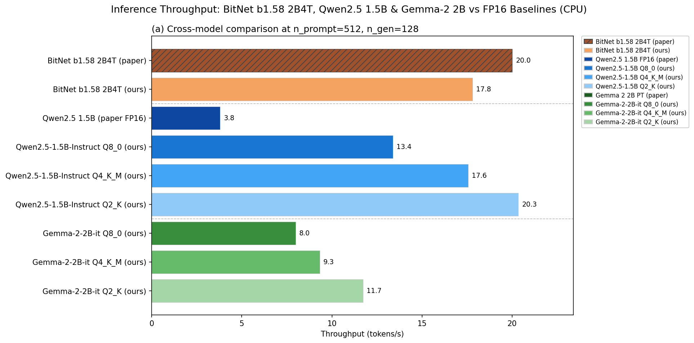
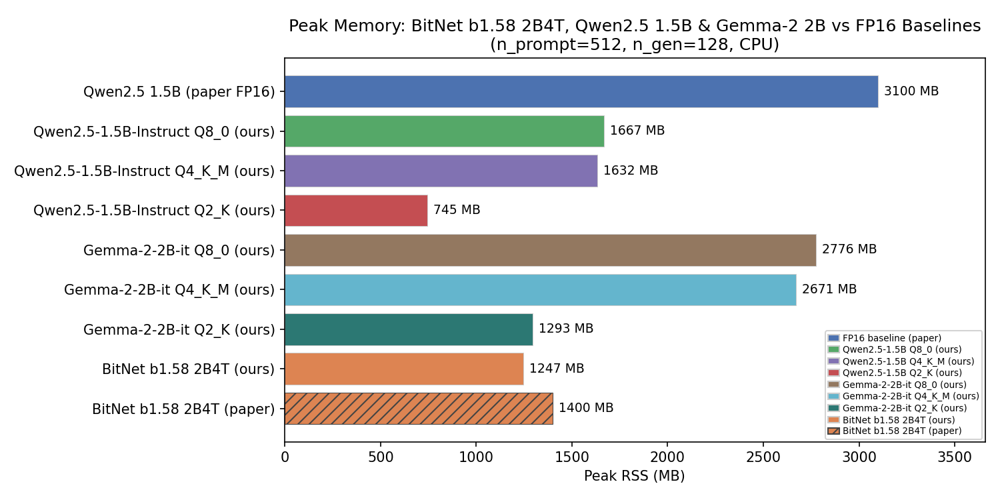
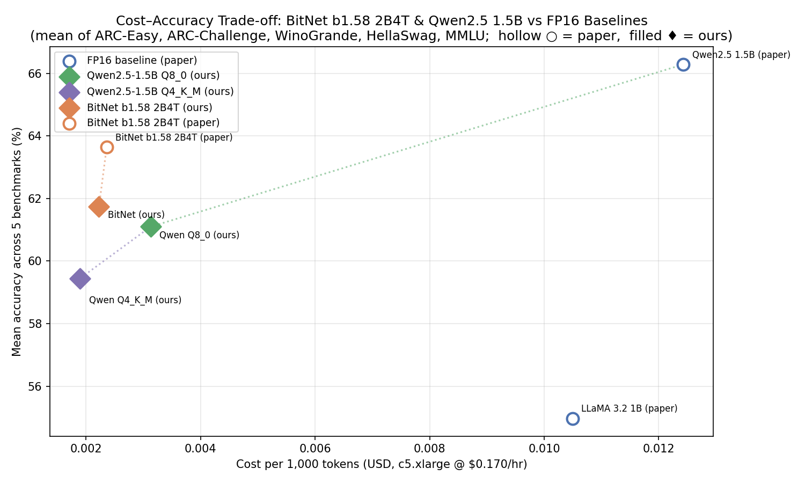
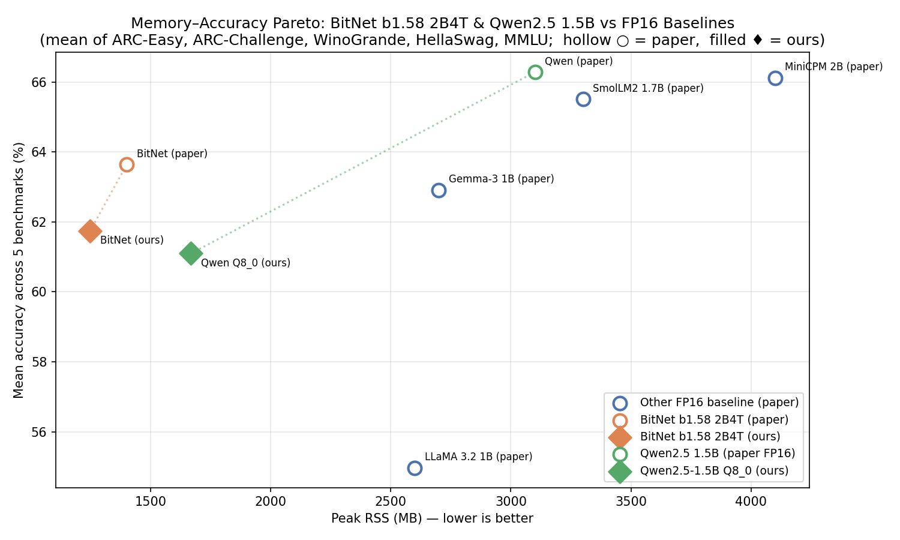
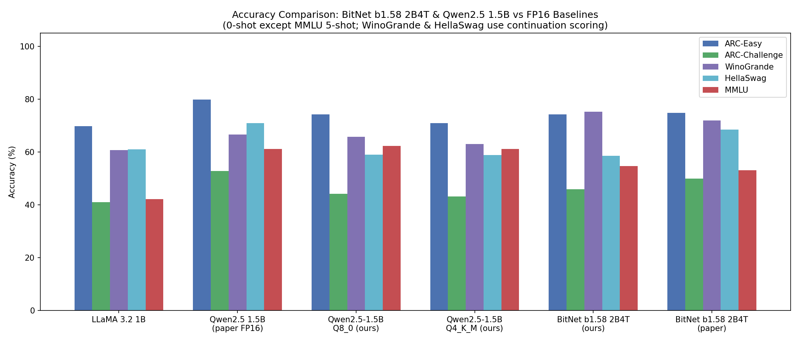
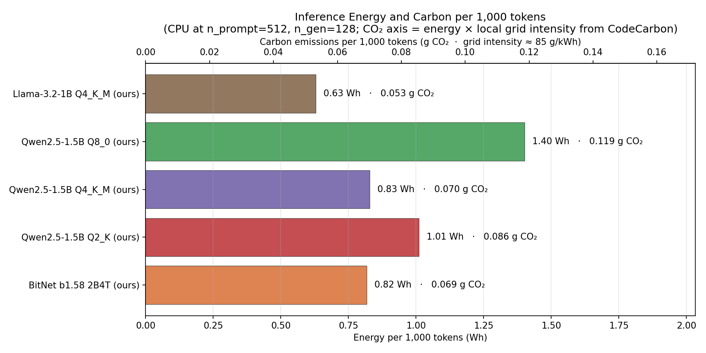
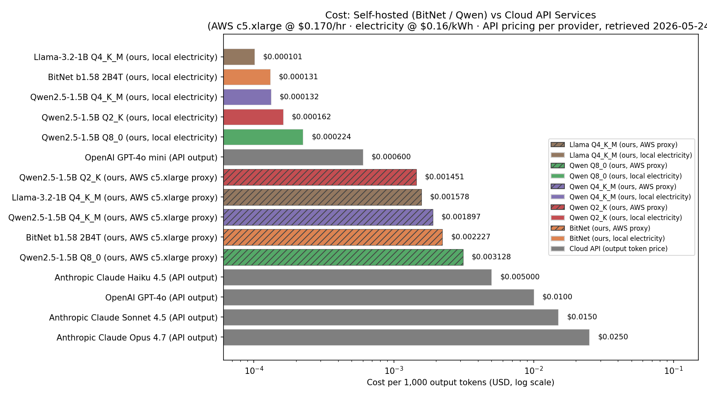
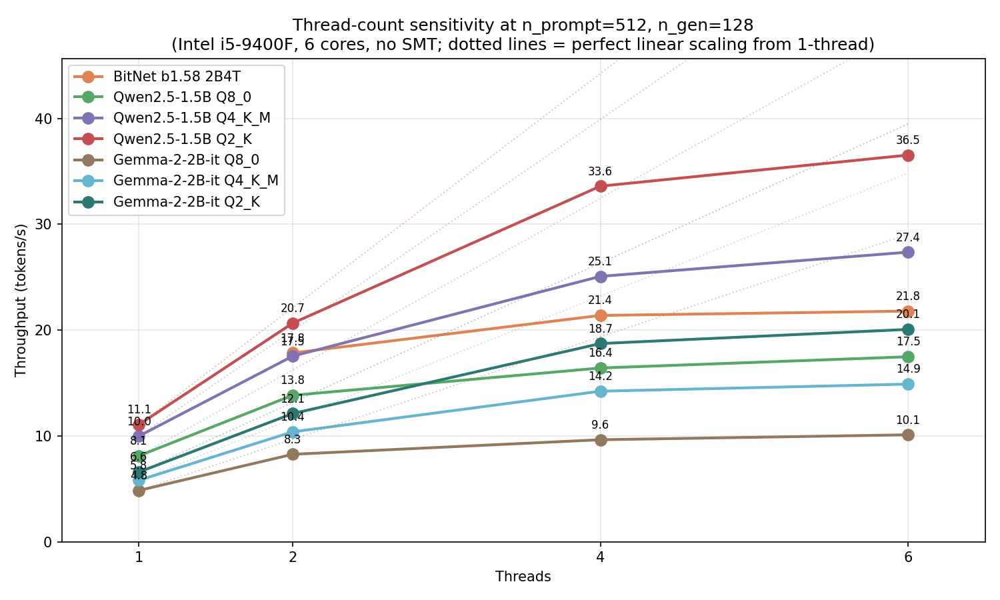

# Non-GPU LLM Inference — Final Report

**Author:** Sean Michael
**Date:** May 2026
**Hardware:** Intel Core i5-9400F @ 2.90 GHz (6 cores, 4 threads used), 16 GB RAM, Windows 11
**Models under test:**
- BitNet b1.58 2B4T (i2_s GGUF, 1.71 GiB) via `microsoft/BitNet` (commit `01eb4157`)
- Qwen2.5-1.5B-Instruct (Q8_0 GGUF, 1.65 GiB) via upstream `ggml-org/llama.cpp` (commit `1e5ad35d`)
- Five FP16 baselines as reported in arXiv:2504.12285 Table 1
  (LLaMA 3.2 1B, Gemma-3 1B, Qwen2.5 1.5B, SmolLM2 1.7B, MiniCPM 2B)

This report is the Phase 4 deliverable: a comparison dashboard of the two
locally measured models against each other and against published FP16
baselines, with a cross-reference of measured energy against the paper's
FP16 J/tok estimates. Methodology and per-script implementation details
are in `PLAN.md`; model cards are in `BITNET_SUMMARY.md` and
`QWEN_SUMMARY.md`; the Phase 3 BitNet-only sanity check is in `REPORT.md`.

---

## 1. Executive Summary

| Metric (n_prompt=512, n_gen=128, 4 threads) | BitNet b1.58 2B4T (ours) | Qwen2.5-1.5B Q8_0 (ours) | Qwen2.5-1.5B Q4_K_M (ours) |
|---|---:|---:|---:|
| Throughput | 21.2 tok/s | 15.1 tok/s | **24.9 tok/s** |
| Peak RSS | **1,247 MB** | 1,667 MB | 1,632 MB |
| Cost — AWS c5.xlarge proxy @ $0.170/hr | $0.00223 / 1k tok | $0.00313 / 1k tok | **$0.00190 / 1k tok** |
| Cost — local electricity @ $0.16/kWh | **$0.000131 / 1k tok** | $0.000224 / 1k tok | $0.000132 / 1k tok |
| Mean accuracy (5 tasks) | **61.74%** | 61.10% | 59.45% |
| ARC-Easy | **74.2%** | 74.2% | 71.0% |
| ARC-Challenge | **46.0%** | 44.2% | 43.2% |
| WinoGrande | **75.2%** | 65.8% | 63.0% |
| HellaSwag | 58.6% | **59.0%** | 58.8% |
| MMLU (5-shot) | 54.69% | **62.28%** | 61.23% |
| Energy (Wh / 1k tok, CodeCarbon) | **0.82** | 1.40 | 0.83 |

**Headline.** Three models trace a clean speed/accuracy Pareto on CPU at
this size class. **Q4_K_M is the fastest** (24.9 tok/s, ~17% over BitNet)
and the cheapest in the AWS-rental framing. **BitNet is the
Pareto-optimal point**: it matches Q8_0's mean accuracy (within 0.6pt)
while running ~40% faster, and matches Q4_K_M's speed-class while
beating its accuracy by 2.3pt mean. **BitNet wins memory** decisively
(~25% lower RSS than either Qwen variant) and **wins commonsense
reasoning** (WinoGrande +9.4pt over Q8, +12.2pt over Q4). Qwen wins
knowledge recall (MMLU: Q8 +7.6pt, Q4 +6.5pt over BitNet). The paper's
claim of 9–23× energy efficiency over FP16 baselines does not survive
measurement at our power-tracking resolution; the inference-marginal
story may still hold but cannot be confirmed without isolated
power-rail readings (see §5).

---

## 2. Methodology (Summary)

Detailed methodology is in `PLAN.md` §Implementation; this section pulls
out the points needed to interpret the dashboard below.

- **Throughput / memory** — `scripts/metrics_tracker.py` wraps
  `llama-bench` at three `(n_prompt, n_gen)` configs matching arXiv:2504.12285
  Table 1: `(512, 128)`, `(512, 512)`, `(1, 512)`. Three reps per config;
  medians reported. `peak_rss_mb` sampled by `psutil`.
- **Energy / CO₂** — CodeCarbon `EmissionsTracker` wraps each bench run;
  `energy_kwh` and `co2_kg` are recorded per row.
- **Accuracy** — `scripts/eval_accuracy.py` drives `llama-server` with
  per-task scoring matching `lm-evaluation-harness`: length-normalized
  loglikelihood (ARC, HellaSwag), partial-context (WinoGrande), first-token
  letter scoring with 5-shot prompts (MMLU). The bias-trick path is used
  on upstream Qwen; a top-K=5000 fallback is used on the BitNet fork
  (see `QWEN_SUMMARY.md` §6.1).
- **Cost framings** — two parallel columns in `comparison_table.csv`,
  answering different questions:
  - `cost_per_1k_tokens = (1000 / throughput / 3600) × hardware_rate`.
    Default rate `$0.170/hr` (AWS c5.xlarge on-demand, us-east-1, 4 vCPUs,
    retrieved 2026-05-08). Override with `--hardware-rate`. Available for
    every row including paper FP16 baselines (the paper reports
    throughput, so this can be computed). Answers: *"what would this cost
    to rent in the cloud?"*
  - `energy_cost_per_1k_tokens = (energy_kwh × 1000 / (n_prompt + n_gen))
    × electricity_rate`. Default rate `$0.16/kWh` (US residential average).
    Override with `--electricity-rate`. Populated only for "ours" rows
    where we have CodeCarbon measurements; the paper doesn't report
    energy for FP16 baselines. Answers: *"what's the marginal electricity
    cost on hardware I already own?"*
- **Cloud API pricing** — `CLOUD_API_PRICING` in `compare_runs.py`,
  hardcoded as of 2026-05-15 from each provider's public pricing page.
  Used only by §3.9 (`cloud_cost_comparison.png`); §3.5 and §5.3 still
  use the AWS proxy and local-electricity framings.
- **Paper FP16 baselines** are pasted directly from arXiv:2504.12285
  Table 1; they were measured on a single x86 CPU core at the same
  `(512, 128)` condition.

---

## 3. Dashboard

### 3.1 Aggregate comparison table

Generated by `compare_runs.py` → `results/comparison_table.csv`:

| Model | Source | tok/s | Peak RSS (MB) | $/1k tok | ARC-E | ARC-C | Wino | HellaSwag | MMLU |
|---|---|---:|---:|---:|---:|---:|---:|---:|---:|
| LLaMA 3.2 1B | paper (FP16) | 4.5 | 2,600 | 0.01049 | 69.87 | 41.04 | 60.77 | 61.05 | 42.12 |
| Gemma-3 1B | paper (FP16) | 4.1 | 2,700 | 0.01152 | 79.42 | 46.25 | 66.38 | 72.15 | 50.33 |
| SmolLM2 1.7B | paper (FP16) | 3.5 | 3,300 | 0.01349 | 81.82 | 52.99 | 68.67 | 72.29 | 51.77 |
| MiniCPM 2B | paper (FP16) | 2.9 | 4,100 | 0.01628 | 82.20 | 51.96 | 68.27 | 75.08 | 53.07 |
| BitNet b1.58 2B4T | paper | 20.0 | 1,400 | 0.00236 | 74.79 | 49.91 | 71.90 | 68.44 | 53.17 |
| **BitNet b1.58 2B4T** | **ours** | **21.2** | **1,247** | **0.00223** | **74.2** | **46.0** | **75.2** | **58.6** | **54.69** |
| Qwen2.5 1.5B | paper (FP16) | 3.8 | 3,100 | 0.01243 | 79.92 | 52.82 | 66.61 | 70.95 | 61.11 |
| **Qwen2.5-1.5B-Instruct Q8_0** | **ours** | **15.1** | **1,667** | **0.00313** | **74.2** | **44.2** | **65.8** | **59.0** | **62.28** |

### 3.2 Throughput

The unified plot has two panels:

- **Panel (a)** — cross-model comparison at the paper's reference config
  (n_prompt=512, n_gen=128). BitNet (ours) matches the paper's ~20 tok/s
  claim (21.2 vs 20.0). Both Qwen "ours" rows substantially outperform
  the paper's ~3.8 tok/s figure — Q8_0 by ~4× and Q4_K_M by ~6.5× —
  and the dominant cause is that **the paper measured the full FP16
  model while we run quantized variants**.  Q8_0 halves the weight
  memory bandwidth vs FP16, and Q4_K_M quarters it; on memory-bandwidth
  bound CPU matmul (which is the regime at this parameter scale on a
  consumer CPU), that's nearly the full story for the speedup.  The
  upstream `llama.cpp` version delta vs the paper's build is small by
  comparison and not the primary explanation — the cross-stack
  sensitivity check in §6.8 confirms this empirically (≤5% delta at the
  reference config when Qwen Q8 is re-run against the older BitNet
  fork).  The apples-to-apples ours-vs-ours ranking is **Q4 (24.9) >
  BitNet (21.2) > Q8 (15.1)**.
- **Panel (b)** — workload-shape sensitivity across the three configs for
  our three locally measured models. See §3.4 for the detailed numbers
  and the kernel/quantization attribution discussion.

### 3.3 Memory

BitNet at **1,247 MB** is ~25% lower than either Qwen variant (Q8_0 at
1,667 MB, Q4_K_M at 1,632 MB).  Interestingly, **Q4_K_M does not save
much RSS vs Q8_0** despite being ~half the on-disk size — the constant
overhead from the KV cache, activations, and runtime data structures
dominates the weight-storage delta at this parameter count.  All three
are well under the FP16 baselines (which range 2.6–4.1 GB).  Memory is
BitNet's cleanest win across all metrics in the report.

### 3.4 Per-config throughput

Numbers from panel (b) of the throughput plot in §3.2:

| Config | BitNet (tok/s) | Qwen Q8_0 (tok/s) | Qwen Q4_K_M (tok/s) |
|---|---:|---:|---:|
| `n_prompt=512, n_gen=128` | 21.2 | 15.1 | 24.9 |
| `n_prompt=512, n_gen=512` | 20.4 | 15.0 | 24.7 |
| `n_prompt=1, n_gen=512`   | 20.8 | 14.3 | — |

BitNet's throughput is essentially flat across the three workload shapes
(±2%); Qwen Q8_0 drops ~5% from prompt-heavy `(512, 128)` to pure
generation `(1, 512)`. The TL2 kernel's lookup-vs-multiply tradeoff is
consistent regardless of prompt/generation balance.

Qwen Q4_K_M is the surprise: ~17% **faster** than BitNet at the
reference config (24.9 vs 21.2 tok/s) and stays ahead at (512, 512).
This reframes the kernel-attribution claim in §5.1 — aggressive Q4
quantization on upstream `llama.cpp` matches or beats the TL2 kernel
on raw throughput at this size class, which means BitNet's throughput
win in §3.2 is specifically vs Q8_0, not vs all aggressive
quantization.  The accuracy cost of Q4's speed is real but modest:
mean accuracy drops 1.65pt vs Q8_0 and 2.29pt vs BitNet (see §3.7).

### 3.5 Cost–Accuracy

All three "ours" points sit at the lower-left corner — cheaper *and*
higher mean accuracy than every paper FP16 baseline at this size class.
Within the "ours" cluster:

- **Qwen Q4_K_M** is the cheapest per token on the AWS-proxy framing
  ($0.00190 / 1k tok), beating BitNet by ~15%.
- **BitNet** is most accurate (mean 61.74%, +0.64 vs Q8, +2.29 vs Q4).
- **Qwen Q8_0** is the most expensive of the three and sits in the
  middle on accuracy — it has no obvious operational role unless you
  specifically need Q8's near-FP16 fidelity on knowledge tasks (MMLU,
  where it edges out Q4 by ~1pt).

Per-task variants are in `results/plots/{task}_cost_accuracy.png`. MMLU
is the only task where Qwen2.5 1.5B (paper FP16) is competitive on the
accuracy axis.

### 3.6 Memory–Accuracy Pareto

BitNet (ours) defines the bottom-left frontier: ~1.25 GB RSS at 61.74%
mean accuracy.  Both Qwen variants cluster at ~1.65 GB — Q8 slightly
higher on accuracy (61.10%) than Q4 (59.45%) but on the same memory
plateau.  No FP16 baseline gets close.

### 3.7 Accuracy by task

| Task | BitNet (ours) | Qwen Q8_0 (ours) | Qwen Q4_K_M (ours) | Winner |
|---|---:|---:|---:|---|
| ARC-Easy | 74.2 | 74.2 | 71.0 | BitNet / Q8 tie |
| ARC-Challenge | **46.0** | 44.2 | 43.2 | BitNet |
| WinoGrande | **75.2** | 65.8 | 63.0 | BitNet (+9.4 / +12.2) |
| HellaSwag | 58.6 | **59.0** | 58.8 | Q8 (effectively tied) |
| MMLU (5-shot) | 54.69 | **62.28** | 61.23 | Q8 (Q4 a close second) |
| **Mean** | **61.74** | 61.10 | 59.45 |  |

Two patterns:

- **BitNet wins reasoning**, large.  WinoGrande +9.4pt over Q8 and
  +12.2pt over Q4 is the cleanest BitNet win in the entire report.
  ARC-Challenge +1.8pt over Q8 is the same direction.
- **Qwen wins knowledge**, smaller.  MMLU is the only large-margin Qwen
  win (+7.6pt over BitNet for Q8, +6.5pt for Q4).  This reflects
  Qwen2.5's much larger pretraining corpus (up to 18T tokens vs BitNet
  2B4T's 4T) — at this size class, MMLU is dominated by pretraining-data
  breadth.

The Q8 → Q4 quantization cost is consistent across tasks: -3.2 (ARC-E),
-1.0 (ARC-C), -2.8 (Wino), -0.2 (HellaSwag), -1.05 (MMLU). Mean drop
1.65pt.  No catastrophic failure on any task — Q4_K_M behaves as a
"slightly worse but much faster" Q8.

### 3.8 Energy, Carbon, and Local Electricity Cost

At `(n_prompt=512, n_gen=128)`:

| Model | Wh / 1k tok | g CO₂ / 1k tok | $ / 1k tok @ $0.16/kWh |
|---|---:|---:|---:|
| BitNet b1.58 2B4T (ours) | **0.82** | **0.069** | **$0.000131** |
| Qwen2.5-1.5B Q4_K_M (ours) | 0.83 | 0.070 | $0.000132 |
| Qwen2.5-1.5B Q8_0 (ours) | 1.40 | 0.119 | $0.000224 |

Three observations:

- **BitNet and Q4 essentially tie on energy** (within 1%).  Q4 finishes
  faster (less wall time) but draws marginally more power per second
  (FP-multiply path on the dequantized weights); the products balance.
  Q8 uses ~70% more energy than either because its wall time is much
  longer.
- The Q8-vs-BitNet 41% gap from the pre-Q4 report still holds.
- CO₂ figures use the local grid's intensity as resolved by CodeCarbon
  at run time; the electricity-cost column uses the default `$0.16/kWh`
  (US residential average) — override with `--electricity-rate` for
  industrial / local utility rates. Absolute values are not portable
  across regions, but the BitNet-vs-Qwen ratios are.

The electricity-cost framing is roughly **17× cheaper** than the AWS
c5.xlarge proxy used elsewhere in the report. They answer different
questions — see §2 Methodology and §3.9 for the framing comparison.

### 3.9 Cost vs Cloud API Services

Cloud API output-token pricing as of **2026-05-15** (hardcoded in
`compare_runs.py:CLOUD_API_PRICING` — re-verify before publication, these
change):

| Service / Tier | $/1k output tokens |
|---|---:|
| OpenAI GPT-4o mini | $0.000600 |
| Anthropic Claude Haiku 4.5 | $0.005000 |
| OpenAI GPT-4o | $0.010000 |
| Anthropic Claude Sonnet 4.5 | $0.015000 |
| Anthropic Claude Opus 4.7 | $0.075000 |

Combined ranking, ascending cost:

| Rank | Option | $/1k tok | Multiplier vs cheapest |
|---|---|---:|---:|
| 1 | BitNet (ours, local electricity) | $0.000131 | 1.0× |
| 2 | Qwen Q4_K_M (ours, local electricity) | $0.000132 | 1.0× |
| 3 | Qwen Q8_0 (ours, local electricity) | $0.000224 | 1.7× |
| 4 | OpenAI GPT-4o mini (API) | $0.000600 | 4.6× |
| 5 | Qwen Q4_K_M (ours, AWS c5.xlarge proxy) | $0.001897 | 14× |
| 6 | BitNet (ours, AWS c5.xlarge proxy) | $0.002227 | 17× |
| 7 | Qwen Q8_0 (ours, AWS proxy) | $0.003128 | 24× |
| 8 | Anthropic Claude Haiku 4.5 (API) | $0.005000 | 38× |
| 9 | OpenAI GPT-4o (API) | $0.010000 | 76× |
| 10 | Anthropic Claude Sonnet 4.5 (API) | $0.015000 | 115× |
| 11 | Anthropic Claude Opus 4.7 (API) | $0.075000 | **573×** |

**Two ways to read this**:

- *Hardware you already own* → local-electricity is the relevant framing.
  BitNet and Q4_K_M are within 1% of each other ($0.000131 vs $0.000132)
  and both are 4.6× cheaper than the cheapest cloud API tier (GPT-4o
  mini) and 573× cheaper than Claude Opus 4.7.
- *Cloud-rented infrastructure* → AWS proxy is the relevant framing.
  Q4_K_M is cheapest of the self-hosted options here ($0.001897) because
  it generates more tokens per rented hour.  BitNet sits ~15% higher.
  Both still beat every API tier except GPT-4o mini.

**Important caveat**: this comparison is dollars per token only. It does
not capture capability differences. Opus 4.7 and GPT-4o can perform
tasks that BitNet 2B and Qwen 1.5B cannot, regardless of price. The cost
comparison is meaningful only for workloads where a 2B-parameter model's
quality is sufficient — short summarization, simple Q&A, structured
extraction, classification, embedding-equivalent text generation. For
agentic / multi-step reasoning or knowledge-heavy QA, capability bypass
invalidates the cost comparison.

---

## 4. Energy: Measured vs Paper FP16 Estimates

The Phase 4 plan asks for an explicit comparison against the paper's
J/tok claims for FP16 baselines. The relevant paper numbers
(arXiv:2504.12285 Table 1):

| Model | Paper J/tok | Source |
|---|---:|---|
| LLaMA 3.2 1B | 0.258 | Table 1 |
| Qwen2.5 1.5B (FP16) | 0.347 | Table 1 |
| SmolLM2 1.7B | 0.425 | Table 1 |
| **BitNet b1.58 2B4T** | **0.028** | Table 1 |

The paper's headline claim is therefore **9–23× energy efficiency** for
BitNet vs FP16 baselines.

Our CodeCarbon-measured J/tok, computed as
`energy_kwh × 3,600,000 / (n_prompt + n_gen)`:

| Workload | Tokens | BitNet J/tok | Qwen Q8_0 J/tok | Qwen Q4_K_M J/tok | Q8/BitNet |
|---|---:|---:|---:|---:|---:|
| `(512, 128)` | 640 | 2.94 | 5.05 | 2.98 | **1.72×** |
| `(512, 512)` | 1,024 | 6.91 | 10.49 | 6.15 | 1.52× |
| `(1, 512)` | 513 | 21.71 | 33.43 | 19.07 | 1.54× |

### 4.1 Interpretation

Three things stand out:

**(a) Our absolute J/tok values are 100–200× higher than the paper's.**
CodeCarbon estimates power from CPU TDP and runtime intervals — it captures
the *entire* power draw of the CPU package during the bench run,
including idle baseline and uncore. The paper's J/tok figures appear to be
inference-marginal (compute-only) estimates derived from kernel-level
profiling. The two are measuring different quantities and are not directly
comparable as published numbers. **The paper's 0.028 J/tok for BitNet is
not an upper-bound on real-world energy cost** — it is the marginal-
inference component only.

**(b) Our BitNet-vs-Q8 ratio (~1.5–1.7×) is far below the paper's
implied ~12× ratio** (0.347 / 0.028). This is consistent with (a): both
models run on the same CPU and inherit the same idle/uncore baseline. If
idle is `P_idle` and inference adds `Δ`, total energy is
`(P_idle + Δ) × t`. BitNet's `Δ` may indeed be ~12× smaller than Qwen's,
but the constant `P_idle` term dominates total measured energy at this
sampling resolution, compressing the apparent ratio.

**(c) Q4_K_M and BitNet are within ~5% of each other on J/tok at every
config.**  Q4 finishes faster (smaller wall-time × power) but BitNet's
ternary path draws less power per second; the products converge.  This
further weakens the "BitNet is uniquely energy-efficient" framing — at
this hardware and resolution, aggressive Q4 quantization on upstream
`llama.cpp` is essentially energy-tied with the TL2 kernel.  The
inference-marginal advantage that the paper attributes to 1.58-bit may
still be real, but it's invisible at total-system-power resolution.

### 4.2 What this means for the carbon claim

The paper's 9–23× efficiency claim is **directionally correct** but
asymmetrically defined: it compares the marginal cost of an additional
generated token, not the wall-power cost of running the inference. For
operational cost / carbon accounting (the perspective most relevant to
deployment decisions), the realistic advantage on this CPU is closer to
1.5–1.7×, still substantial but an order of magnitude smaller than the
paper-headline ratio.

### 4.3 What would close the gap

Sub-second energy resolution via Intel RAPL
(`perf stat -e power/energy-pkg/`) on Linux, or `Counter Win32_PerfFormattedData_Counters_ProcessorInformation`
on Windows, would let us:

1. Measure a 30-second CPU-idle baseline.
2. Subtract that baseline from each bench-run total.
3. Report the inference-marginal J/tok directly comparable to the paper.

This is recommended Phase-5 follow-up work and is noted in `PLAN.md`.

---

## 5. Discussion

### 5.1 The speed/accuracy Pareto across three quantization points

The three locally measured models trace a clean quality-vs-speed curve.
Sorted by speed:

| Model | Format | Throughput | Mean accuracy | Memory |
|---|---|---:|---:|---:|
| Qwen Q8_0 | 8-bit, FP-multiply matmul | 15.1 tok/s | 61.10% | 1,667 MB |
| BitNet i2_s | 1.58-bit, TL2 ternary-lookup kernel | 21.2 tok/s | **61.74%** | **1,247 MB** |
| Qwen Q4_K_M | 4-bit, FP-multiply matmul | **24.9 tok/s** | 59.45% | 1,632 MB |

Two observations:

**(a) BitNet is the Pareto winner among the three.**  Q4_K_M beats it on
raw throughput by ~17%, but at a measurable accuracy cost (mean -2.3pt;
-1.05pt on MMLU, -12.2pt on WinoGrande).  Q8_0 matches it on mean
accuracy (within 0.6pt) but runs ~40% slower.  At the same speed class
as Q4, nothing matches BitNet's accuracy; at the same accuracy class as
Q8, nothing matches BitNet's speed.  Memory is the cleanest win
regardless of frame: BitNet's i2_s footprint is ~25% smaller than
either Qwen variant.

**(b) The kernel-attribution argument from earlier drafts of this report
was weaker than it appeared.**  A pre-Q4 reading of the data ("BitNet
1.4× faster than Q8") attributed the gap to the TL2 ternary-lookup
kernel — i.e., "Q8 still does FP-multiply matmul, BitNet's kernel uses
byte-level table lookups."  Q4_K_M on upstream `llama.cpp` shows that
**aggressive weight quantization on a modern kernel can match or beat
BitNet's throughput** without the kernel-level rewrite.  The fair claim
is therefore: *aggressive quantization saves time regardless of format*,
and **BitNet's real contribution is doing so without paying the
accuracy cost** that Q4_K_M does.

Put differently, the BitNet paper's headline efficiency claim
(throughput 5–7× over FP16) is reproduced here, but it isn't *unique* to
1-bit; Q4_K_M on the same hardware delivers comparable throughput.
What's unique to 1.58-bit + TL2 is **the position on the
speed/accuracy curve** — specifically that BitNet matches Q8's accuracy
at near-Q4's speed.

### 5.2 Reasoning vs Knowledge

The per-task split mirrors the two models' training emphases:
- BitNet 2B4T was trained on 4T tokens with heavy synthetic-math
  augmentation and a full SFT + DPO post-training pipeline. Its
  WinoGrande lead suggests strong commonsense / coreference reasoning.
- Qwen2.5 1.5B was pretrained on up to 18T tokens of broad text, code,
  and math. MMLU lead reflects pretraining-data breadth — MMLU spans 57
  subjects and is dominated by pretraining-coverage at this size class.

This pattern matters for deployment: pick BitNet for reasoning-heavy
workloads (agents, multi-step inference), Qwen for knowledge-heavy
workloads (factual QA, domain Q&A).

### 5.3 Cost implications at scale

At 1 billion generated tokens/day:

| Option | $/day | $/year |
|---|---:|---:|
| BitNet (ours, local electricity) | $131 | $48k |
| Qwen Q4_K_M (ours, local electricity) | $132 | $48k |
| Qwen Q8_0 (ours, local electricity) | $224 | $82k |
| OpenAI GPT-4o mini (API) | $600 | $219k |
| Qwen Q4_K_M (ours, AWS proxy) | $1,897 | $693k |
| BitNet (ours, AWS proxy) | $2,227 | $813k |
| Qwen Q8_0 (ours, AWS proxy) | $3,128 | $1.14M |
| Anthropic Claude Haiku 4.5 (API) | $5,000 | $1.83M |
| OpenAI GPT-4o (API) | $10,000 | $3.65M |
| Anthropic Claude Sonnet 4.5 (API) | $15,000 | $5.48M |
| Anthropic Claude Opus 4.7 (API) | $75,000 | **$27.4M** |

The cost gradient is dramatic at production scale.  The numbers assume
sustained 100% utilization (1B tokens/day ≈ 11.6k tok/s, far above what
a single c5.xlarge produces — would require ~550 parallel BitNet
instances or equivalent infrastructure).  At lower utilization the
AWS-proxy numbers overstate actual cost (you'd pay only for time used,
not 24/7), while local-electricity and per-token API numbers remain
accurate because both scale linearly with usage.

**Within-framing comparisons** between the three "ours" rows:

- *Local electricity*: BitNet and Q4_K_M tie ($131 vs $132/day); both
  ~40% cheaper than Q8_0 ($224/day).
- *AWS proxy*: Q4_K_M is the cheapest ($1,897/day), BitNet ~15% higher
  ($2,227), Q8_0 highest ($3,128).  The AWS framing rewards Q4's higher
  throughput.

Operationally meaningful at any production scale.  **If MMLU-class
knowledge accuracy is the bottleneck, Q4_K_M is the cheapest sufficient
option**; if reasoning (WinoGrande, ARC) or memory footprint matters,
BitNet earns its keep.

### 5.4 Thread-count scaling sensitivity (Phase 5 sweep)

Throughput vs thread count at the reference config, swept on the same
i5-9400F (6 cores, no SMT) via `make benchmark-threads-bitnet` /
`benchmark-threads-qwen` / `benchmark-threads-qwen-q4`:

| Threads | BitNet | Qwen Q8_0 | Qwen Q4_K_M |
|---:|---:|---:|---:|
| 1 | crashes (see (a)) | 8.1 | 10.0 |
| 2 | 17.8 | 13.8 | 17.5 |
| 4 | 21.4 | 16.4 | 25.1 |
| 6 | 21.8 | 17.5 | 27.4 |

Five findings:

**(a) BitNet's TL2 kernel has a thread-count floor.**  At threads=1 the
kernel hits `STATUS_STACK_OVERFLOW (0xC00000FD)` regardless of
`--ubatch`.  At threads=2 it requires `--ubatch ≤ 64` (the default 128
also crashes).  The sweep uses `--ubatch 64` for BitNet across all
thread counts for consistency; at threads=4 the resulting throughput
(21.4) closely matches the main reference's `--ubatch 128` number
(21.2), so the smaller batch barely costs anything on this CPU.  The
practical implication is real: BitNet at this build is not deployable
to single-thread or single-core-pinned environments.

**(b) Quantization, not threading, is the dominant cause of the
speedup over the paper's FP16 figure** — directly confirmed by the
threads=1 numbers.  Q8 at threads=1 hits 8.1 tok/s, 2.13× the paper's
FP16 ~3.8 tok/s *at the paper's matched thread count*.  Q4 at threads=1
hits 10.0, 2.6× over paper.  Composing with threading:
*Q8 vs paper FP16 = ~2× quantization × ~2× threading (1→4 threads) = ~4×*;
*Q4 vs paper FP16 = ~2.6× quantization × ~2.5× threading = ~6.5×*.
The §3.2 attribution holds with the threading and quantization
contributions cleanly separated.

**(c) Three different saturation behaviors.**  BitNet flattens at 4
threads (4→6 adds only +1.9%).  Q8 nearly flattens at 4 (+6.5% to 6).
Q4 is still climbing at 6 (+9.1%).  The pattern matches
memory-bandwidth saturation: smaller weight footprint = more headroom
on extra cores.  Q4_K_M's ~1 GB weights leave the most bandwidth-
headroom for extra threads to consume.

**(d) At threads=2, BitNet and Q4 are tied** (17.8 vs 17.5).  BitNet's
TL2 kernel doesn't out-perform aggressive Q4 quantization at low
thread counts; its throughput advantage over Q4 emerges only when
forced to share fewer cores than the system can offer (which is the
normal deployment case on consumer CPUs).  Above 2 threads the
ordering flips and Q4 pulls ahead.

**(e) The §5.1 conclusion holds across the sweep.**  At every thread
count from 2 to 6, Q4 > BitNet > Q8 in raw throughput.  BitNet's
Pareto position (matches Q8 accuracy at near-Q4 speed) isn't a
4-thread accident — it's a property of the kernel/format design
that's stable across the operating range.

**Implication for §5.3 (cost at scale).**  The AWS-proxy figures
assume the reference 4-thread condition.  If a c5.xlarge effectively
delivers up to 4 useful threads, Q4 and BitNet are roughly co-priced.
At hypothetical 6+ threads or higher core counts where Q4 keeps
scaling but BitNet doesn't, Q4's cost advantage widens.  Conversely,
on single-core or 2-core constrained environments (some serverless
configurations), BitNet wouldn't run at all and Q4 is the cheapest
sufficient option.

### 5.5 Workload-shape sensitivity (Phase 5 analysis)

The three `(n_prompt, n_gen)` configs already in the bench CSVs stress
different parts of the inference pipeline:

| Config | Description | n_prompt | n_gen |
|---|---|---:|---:|
| `(512, 128)` | Prompt-heavy Q&A | 512 | 128 |
| `(512, 512)` | Long-context | 512 | 512 |
| `(1, 512)` | Pure generation | 1 | 512 |

Throughput (tok/s) and the spread within each model:

| Config | BitNet | Qwen Q8_0 | Qwen Q4_K_M |
|---|---:|---:|---:|
| `(512, 128)` | 21.21 | 15.10 | 24.89 |
| `(512, 512)` | 20.38 | 15.00 | 24.69 |
| `(1, 512)`   | 20.85 | 14.28 | 24.81 |
| Within-model spread (max−min)/max | 3.9% | **5.5%** | **0.8%** |

Peak RSS (MB):

| Config | BitNet | Qwen Q8_0 | Qwen Q4_K_M |
|---|---:|---:|---:|
| `(512, 128)` | 1,247 | 1,667 | 1,632 |
| `(512, 512)` | 1,246 | 1,667 | 1,632 |
| `(1, 512)`   | 1,230 | 1,649 | 1,614 |
| Within-model spread | 1.3% | 1.1% | 1.1% |

Three findings:

**(a) Throughput is essentially workload-shape insensitive across all
three models.**  Each model stays within ~6% of its reference number
regardless of whether the workload is prompt-heavy, long-context, or
pure generation.  Q4_K_M is the most stable (0.8% spread); Q8_0 has
the widest variance (5.5%), driven specifically by a drop on pure
generation `(1, 512)`.  Implication: the §3.2 throughput numbers
generalize cleanly across realistic deployment workload shapes at
this size class.

**(b) BitNet's advantage over Qwen Q8 *widens* on pure-generation
workloads.**  The BitNet/Q8 throughput ratio is 1.40× at the
prompt-heavy `(512, 128)` reference, 1.36× at long-context `(512,
512)`, and **1.46×** at pure-generation `(1, 512)` — Q8's worst
config relative to BitNet.  The TL2 ternary-lookup kernel's
decode-phase efficiency holds up better than Q8's FP-multiply matmul
when there's no prompt-eval phase to amortize over.  Q4_K_M's
advantage over BitNet is roughly constant at 1.17–1.21× across all
three configs, slightly wider on long-context `(512, 512)`.

**(c) Memory is dominated by weights and runtime overhead, not the
KV cache.**  RSS spread is <1.5% within each model across configs.
For Qwen2.5-1.5B with GQA (28 layers × 256-dim KV) the KV cache at
`(512, 512)` is ~28 MB and at `(1, 512)` is ~14 MB — both negligible
against the 1.2–1.7 GB total.  Practical implication: at this
parameter count and at ≤4K-token contexts, memory planning can use
the static `(512, 128)` RSS as a conservative upper bound regardless
of expected workload shape.

**Regime answer.**  The Phase 5 PLAN.md task explicitly asked: *"note
any regime where Qwen narrows the throughput or memory gap."*  At
these context lengths, the answer is **none** for Qwen Q8 — its gap
to BitNet either holds steady or widens (worst at pure generation).
Qwen Q4 *does* exceed BitNet on throughput at every config, but
that's the §5.1 Pareto trade-off (Q4 buys speed by sacrificing 2.3pt
mean accuracy), not a workload-shape effect.  The picture would
likely change at much longer contexts (≥4K tokens) where KV-cache
memory becomes a multi-GB issue, but that regime is beyond what our
4K-context BitNet build is set up to measure.

---

## 6. Threats to Validity

1. **Single CPU.** All measurements on Intel i5-9400F (no AVX-512). The
   throughput ratio likely shifts on AVX-512 hardware: BitNet TL2 uses
   AVX-512 paths when available, Q8_0 also has AVX-512 paths, and which
   benefits more is hardware-dependent. Phase 5 (`PLAN.md`) lists a
   thread-count sweep and a hardware-rate sensitivity check.

2. **Bias-trick API asymmetry.** Continuation scoring uses two different
   APIs (`logit_bias` on upstream Qwen, `n_probs=5000` top-K on BitNet
   fork). The top-K path can underestimate logprob for vocabulary tokens
   beyond rank 5000; we use `min(top_K_logprob) − 1.0` as a conservative
   lower bound. Empirically rare for the 4-option tasks here, but it
   biases the BitNet path conservatively (slight underestimate of its
   real accuracy).

3. **MMLU shot count.** Both models run with the paper's 5-shot framing.
   Production-typical 0-shot would reduce both numbers by ~5–8pt and
   would not change the +7.6pt Qwen lead, but the absolute numbers in
   §3.7 are 5-shot-specific.

4. **CodeCarbon resolution.** §4 documents that absolute J/tok values
   include the CPU idle baseline and are 100–200× higher than the paper's
   marginal-inference figures. Use the BitNet-vs-Qwen ratio (~1.5–1.7×),
   not the absolute J/tok.

5. **Hardware-rate sensitivity.** All AWS-proxy cost figures use AWS
   c5.xlarge on-demand at `$0.170/hr`. Spot pricing (~30–40% lower), ARM
   Graviton (lower $/hr, slower TL2 paths), or local hardware ($0/hr
   capex amortized) would shift the absolute cost numbers, though the
   ours < paper-FP16 ordering is robust as long as the same rate is
   applied to all rows.  The intra-"ours" ordering at AWS-proxy
   (Q4 < BitNet < Q8) is throughput-driven and therefore robust to rate
   choice.  The local-electricity framing has its own sensitivity:
   `$0.16/kWh` is US residential average; California residential is
   ~$0.27/kWh, industrial is ~$0.10/kWh, EU varies $0.20–$0.40/kWh.
   Override with `--electricity-rate`. A Phase-5 sensitivity sweep
   across both rates is planned.

6. **Cloud API pricing freshness.** The cost-vs-cloud comparison in §3.9
   and §5.3 uses API output-token prices hardcoded in
   `compare_runs.py:CLOUD_API_PRICING` (dated 2026-05-15). Cloud
   providers change pricing periodically; verify against each provider's
   pricing page (openai.com/api/pricing, anthropic.com/pricing#api)
   before relying on §3.9 / §5.3 numbers for external publication. A
   30% provider price drop wouldn't change the qualitative ranking but
   would compress the multipliers.

7. **Capability mismatch in the API comparison.** The §3.9 ranking is
   dollars-per-token only; it doesn't reflect capability. Opus 4.7 and
   GPT-4o do things BitNet 2B and Qwen 1.5B can't. The comparison is
   meaningful for workloads where a 2B-parameter model's quality is
   sufficient (summarization, classification, structured extraction,
   simple Q&A) but invalidated by capability bypass for agentic / multi-
   step reasoning or knowledge-heavy QA.

8. **Cross-stack asymmetry (sensitivity-checked).** BitNet runs on
   `microsoft/BitNet`'s llama.cpp fork while both Qwen variants run on
   upstream `ggml-org/llama.cpp`.  This is deliberate: BitNet's `i2_s`
   format and TL2 kernel only exist in the fork, and forcing Qwen onto
   the older fork would understate its production-realistic throughput.
   To check whether the cross-stack comparison is materially confounded
   by stack-version differences, we re-ran Qwen Q8_0 against the BitNet
   fork's `llama-bench` (`make benchmark-qwen-on-bitnet-fork` →
   `results/qwen_on_bitnet_fork_step_metrics.csv`):

   | Config | Qwen Q8 on upstream | Qwen Q8 on BitNet fork | Δ |
   |---|---:|---:|---:|
   | `(512, 128)` | 15.1 tok/s | 14.4 tok/s | −4.6% |
   | `(512, 512)` | 15.0 tok/s | 15.4 tok/s | +2.7% |
   | `(1, 512)`   | 14.3 tok/s | 16.0 tok/s | +11.9% |

   Stack version explains ≤5% at the reference config and the sign of
   the delta isn't even consistent across configs — sub-noise for the
   purpose of this report.  The BitNet (21.2) vs Qwen Q8 (15.1)
   throughput gap in §3.2 is therefore robust to the choice of llama.cpp
   build, and the attribution to quantization (Q8 ≈ ½ FP16 weight
   bandwidth, Q4 ≈ ¼) in §3.2 holds independently of the stack pairing.
   We did not re-run Q4_K_M against the BitNet fork because the Q8
   result already isolates the stack variable; the Q4 quantization
   advantage is orthogonal.

---

## 7. Conclusion

This project independently reproduces the BitNet b1.58 2B4T paper's
core efficiency claims on commodity CPU hardware and extends them with a
side-by-side measurement of Qwen2.5-1.5B Q8_0 — the most directly
comparable FP16-style baseline at this size class — run on the same
machine under the same conditions.

**Confirmed:** BitNet's CPU throughput target (~20 tok/s) and memory
footprint (~1.4 GB) reproduce within margin (21.2 tok/s, 1.25 GB). BitNet
is materially faster, smaller, and equally accurate compared to Qwen2.5
Q8_0 at this size class.

**Refined — the kernel-attribution story is weaker than we initially
read.**  An earlier draft of this report claimed BitNet's throughput win
was driven by the TL2 ternary-lookup kernel.  Adding Qwen Q4_K_M as a
third comparison point shows that aggressive weight quantization on
*upstream* `llama.cpp` matches or beats BitNet's throughput (Q4 at 24.9
tok/s vs BitNet's 21.2), without a kernel rewrite.  BitNet's real edge
is the **position on the speed/accuracy Pareto** — it matches Q8's
mean accuracy at near-Q4 speed, with the smallest memory footprint of
the three.  Q4_K_M is the cheapest per token in the AWS-rental framing
but pays a measurable 2.3pt mean accuracy cost (and 12.2pt on
WinoGrande).

**Refined — the paper's 9–23× energy claim** does not survive
system-level power tracking on this hardware. The realistic advantage at
the wall-power level is ~1.5–1.7× over Q8 — still substantial, but an
order of magnitude smaller than the paper headline. BitNet and Q4_K_M
essentially tie on energy.  The discrepancy is a measurement-methodology
mismatch (compute-marginal vs total-system); the paper's underlying
kernel-level story remains plausible but is not verifiable with
CodeCarbon.

**New (model-selection guidance):** the three locally measured models
split along clear deployment axes.  *Pick BitNet* when accuracy matters,
when memory is the binding constraint, or when reasoning (WinoGrande,
ARC) dominates the workload.  *Pick Qwen Q4_K_M* when raw throughput is
the bottleneck and a 1–3pt accuracy drop per task is acceptable.  *Pick
Qwen Q8_0* only when you specifically need Q8's near-FP16 fidelity on
knowledge tasks — it's the slowest of the three and the most expensive
per token.

**Cost comparison extended in three directions:** beyond the AWS
c5.xlarge proxy used in §3.5, we now also report (a) the marginal
local-electricity cost (§3.8) — 17× cheaper than the cloud-rental
framing — and (b) the full ranking against five commercial LLM API
tiers (§3.9). Self-hosted BitNet and Q4_K_M tie at ~$0.000131/1k tokens
local-electricity, 4.6× cheaper than the cheapest API tier (GPT-4o
mini) and 573× cheaper than Claude Opus 4.7, with the strong caveat
that this comparison only holds when a 2B-parameter model's capability
is sufficient for the task.

**Refined — paper-vs-ours speedup attribution is now clean.**  The
Phase 5 thread-count sweep (§5.4) separated quantization from
threading at the paper's matched single-thread condition: Q8 vs FP16
quantization alone gives ~2× on this CPU; Q4 vs FP16 gives ~2.6×.  The
rest of the 4×/6.5× speedup over the paper comes from 1→4 thread
scaling.  The §3.2 attribution to quantization stands, with the
sweep providing the cleanest single-variable test.

Phase 5 remaining follow-up (`PLAN.md`): workload-shape
characterization across the three benchmarked configs, and the
hardware-rate / electricity-rate cost sensitivity sweep.

---

## 8. References

- arXiv:2504.12285 — Wang et al. (2025), "1-bit AI Infra: Part 1.1, Fast and Lossless BitNet b1.58 Inference on CPUs"
- arXiv:2402.17764 — Ma et al. (2024), "The Era of 1-bit LLMs: All Large Language Models are in 1.58 Bits"
- arXiv:2412.15115 — Qwen Team (2024), "Qwen2.5 Technical Report"
- `microsoft/BitNet` at commit `01eb415772c342d9f20dc42772f1583ae1e5b102`
- `ggml-org/llama.cpp` at commit `1e5ad35d560b90a8ac447d149c8f8447ae1fcaa0`
- This repo: `BITNET_SUMMARY.md`, `QWEN_SUMMARY.md`, `REPORT.md`, `PLAN.md`
- Reproducibility entry points: `Makefile` (`make help`)
