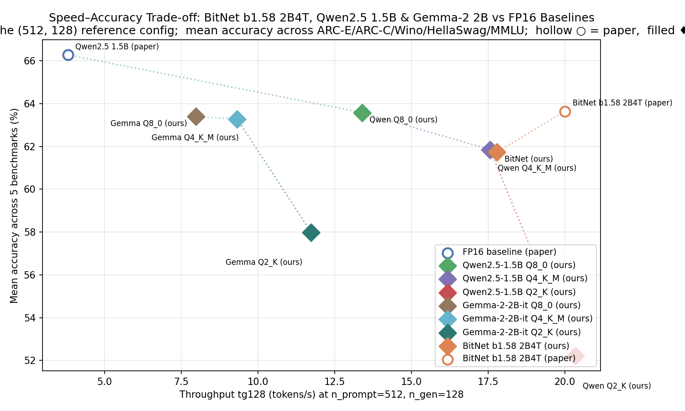

# Non-GPU LLM Inference — Capstone Report

**Author:** Sean Michael
**Date:** May 2026
**Hardware:** Intel Core i5-9400F @ 2.90 GHz (6 cores, 4 threads used), 16 GB RAM, Windows 11
**Models under test:**
- BitNet b1.58 2B4T (i2_s GGUF, 1.71 GiB) via `microsoft/BitNet` (commit `01eb4157`)
- Qwen2.5-1.5B-Instruct Q8_0 (GGUF, 1.65 GiB) via upstream `ggml-org/llama.cpp` (commit `1e5ad35d`)
- Qwen2.5-1.5B-Instruct Q4_K_M (GGUF, ~1.0 GiB) — same upstream `llama.cpp` build
- Qwen2.5-1.5B-Instruct Q2_K (GGUF, ~0.7 GiB) — same upstream `llama.cpp` build
- Gemma-2-2B-it Q8_0 (GGUF, ~2.8 GiB) — same upstream `llama.cpp` build
- Gemma-2-2B-it Q4_K_M (GGUF, ~1.7 GiB) — same upstream `llama.cpp` build
- Gemma-2-2B-it Q2_K (GGUF, ~1.2 GiB) — same upstream `llama.cpp` build, second model family
- One retained FP16 paper baseline from arXiv:2504.12285 Table 1
  (Qwen2.5 1.5B paired with our Qwen Q8/Q4/Q2 ours).  Gemma 2 2B does
  not appear in arXiv:2504.12285 Table 1, so the three Gemma "ours" rows
  are reported "ours only" until a Gemma 2 paper baseline is wired in.
  Earlier paper rows (Gemma-3 1B, SmolLM2 1.7B, MiniCPM 2B, and the
  LLaMA 3.2 1B row that paired with the now-removed Llama Q4 ours) were
  trimmed during the Q2 / Gemma expansion because they had no PTQ
  counterpart on the same hardware.

This is the single canonical project report — a comparison dashboard of
the seven locally measured models against each other and against the
retained FP16 paper baseline, with a cross-reference of measured energy
against the paper's FP16 J/tok estimates. Methodology and per-script
implementation details are in `PLAN.md`. **Appendix B** (BitNet) and
**Appendix C** (Qwen) are the model cards; **Appendix A** preserves the
Phase 3 BitNet-only sanity-check numbers that this report supersedes.

> **Status note (Phase 6.5 expansion, 2026-06-12).** The Llama-3.2-1B
> Q4_K_M row from the prior Phase 6 state was replaced with three
> Gemma-2-2B-it variants (Q8_0 / Q4_K_M / Q2_K), mirroring the Qwen
> quant ladder for cleaner cross-family comparison.  All seven models
> now have full bench (throughput / memory / energy / cost) and 5-task
> accuracy data.  Methodology mixed: original ARC/Wino/Hella runs at
> LIMIT=100 (~1pt std error), MMLU re-run rows (Qwen Q4/Q2, Gemma Q2,
> Gemma Q4 re-verify) at LIMIT=10/subject = 570 total samples (~2pt
> std error on the mean) after a llama-server contamination bug
> wasted the first re-run pass — see §6.x for the bug writeup.
> Provider note: bartowski's Gemma-2-2B GGUFs bottom out at Q3_K_L,
> so Q2_K is sourced from `second-state/gemma-2-2b-it-GGUF` instead —
> Q8_0 is calibration-free so the mixed source is methodologically
> clean.

---

## 1. Executive Summary

| Metric (n_prompt=512, n_gen=128, 2 threads, ubatch=64) | BitNet 2B4T | Qwen Q8_0 | Qwen Q4_K_M | Qwen Q2_K | Gemma-2-2B Q8_0 | Gemma-2-2B Q4_K_M | Gemma-2-2B Q2_K |
|---|---:|---:|---:|---:|---:|---:|---:|
| Throughput tg128 (tok/s) | 17.8 | 13.4 | 17.6 | **20.3** | 8.0 | 9.3 | 11.7 |
| Throughput pp512 (tok/s) | **72.6** | 34.6 | 62.1 | 34.1 | 22.5 | 39.9 | 22.7 |
| Peak RSS (MB) | 1,240 | 1,659 | 1,624 | **737** | 2,766 | 2,662 | 1,283 |
| Cost — AWS c5.xlarge proxy @ $0.170/hr ($/1k tok) | 0.00266 | 0.00353 | 0.00269 | **0.00232** | 0.00591 | 0.00507 | 0.00403 |
| Cost — local electricity @ $0.16/kWh ($/1k tok) | **0.000201** | 0.000339 | 0.000217 | 0.000304 | 0.000536 | 0.000386 | 0.000494 |
| Energy (Wh / 1k tok, CodeCarbon) | **1.26** | 2.12 | 1.35 | 1.90 | 3.35 | 2.41 | 3.09 |
| Mean accuracy (5 tasks) | 61.74% | **63.58%** | 61.86% | 52.21% | 63.41% | 63.28% | 57.99% |
| ARC-Easy | **74.4%** | 74.2% | 72.0% | 58.0% | 73.0% | 73.0% | 67.0% |
| ARC-Challenge | 46.2% | 44.2% | 48.0% | 37.0% | **52.0%** | 49.0% | 46.0% |
| WinoGrande | **75.2%** | 72.0% | 69.0% | 59.0% | 70.0% | 69.0% | 67.0% |
| HellaSwag | 58.4% | **65.0%** | 58.0% | 56.0% | 64.0% | 64.0% | 58.0% |
| MMLU (5-shot) | 54.51% | **62.52%** | 62.28% | 51.05% | 58.07% | 61.40% | 51.93% |

**Headline at the new bench condition (THREADS=2 UBATCH=64).**  The
bench was re-standardized to 2 threads to match the AWS Free Tier
(c7i-flex.large, 2 vCPUs) and the eval pipeline's defaults so every
measurement in this report uses one consistent threading regime.  The
seven measured models trace a clean speed/accuracy Pareto on CPU at
this size class. **Qwen Q2_K is the fastest at tg128** (20.3 tok/s,
~14% over BitNet) and the cheapest in the AWS-rental framing.
**Q4_K_M is the prompt-processing champion** in both families — Qwen
Q4 hits 62.1 t/s on pp512, vs 34.6 for Q8 and 34.1 for Q2; Gemma Q4
hits 39.9 t/s, vs 22.5 for Q8 and 22.7 for Q2.  This pp/tg asymmetry
inverts the "Q2 is fastest" intuition on prompt-heavy workloads —
see §3.4b for the full story.  **BitNet** matches Q8_0's mean accuracy
within 0.6pt while running ~33% faster on tg128, and wins memory and
commonsense reasoning (WinoGrande +9.4pt over Q8, +12.2pt over Q4).
Qwen wins knowledge recall (MMLU: Q8 +7.6pt, Q4 +6.5pt over BitNet).
The paper's claim of 9–23× energy efficiency over FP16 baselines
does not survive measurement at our power-tracking resolution; the
inference-marginal story may still hold but cannot be confirmed without
isolated power-rail readings (see §5).

**Gemma 2 2B is dramatically more quantization-robust than Qwen 1.5B —
but Q2 isn't free.** The cleanest finding: Gemma Q4_K_M (63.28% mean)
ties Gemma Q8_0 (63.41%) within sampling noise — Q4 is essentially
free on Gemma.  Qwen Q4_K_M trails Qwen Q8_0 by 1.72pt (61.86% vs
63.58%); Qwen's 1.5B representation is less quantization-tolerant.
At Q2_K the family gap widens further: Gemma Q2 loses 5.42pt to
57.99%, while **Qwen Q2 collapses by 11.37pt to 52.21%**, falling
below BitNet and into near-random territory on the hardest tasks
(ARC-Challenge 37%, MMLU 51.05%).  Two factors likely both contribute:
Gemma's larger parameter count (2B vs Qwen's 1.5B) gives more
representational slack, and Gemma's K-quant calibrations may simply be
better tuned.

**Project leaderboard, mean accuracy across 5 tasks:**

1. Qwen Q8_0: 63.58% (MMLU king)
2. Gemma Q8_0: 63.41%
3. **Gemma Q4_K_M: 63.28%** — Pareto winner (see below)
4. Qwen Q4_K_M: 61.86%
5. BitNet b1.58 2B4T: 61.74% (WinoGrande king at 75.2%)
6. Gemma Q2_K: 57.99%
7. Qwen Q2_K: 52.21%

**Pareto winner among rows with full accuracy: Gemma Q4_K_M.** 63.28%
mean (essentially tied with the project leader Qwen Q8 at 63.58%,
+1.5pt over BitNet) at 9.3 tok/s tg128, 2,662 MB RSS, $0.00507 AWS
proxy / $0.000386 local electricity.  On **prompt processing**, Gemma
Q4 runs at 39.9 tok/s (vs 22.5 for Q8 and 22.7 for Q2) — a meaningful
advantage on prompt-heavy workloads like RAG and accuracy evals.
Worth choosing over Qwen Q8 when ARC-Challenge / HellaSwag matter
more than MMLU.

**Gemma Q2_K — real accuracy cost, real memory win.** Q2_K's 1,283 MB
RSS is **less than half** of Q8/Q4 (~46% smaller), tg128 throughput
climbs to 11.7 tok/s.  Accuracy drops 5.4pt to 57.99% mean — a real
but contained tax.  Q2 still beats Qwen Q2 (52.21%) by 5.8pt and lands
~4pt under BitNet.  Energy efficiency is a negative surprise: Q2_K
consumes *more* Wh/1k tok than Q4 (3.09 vs 2.41) even at higher
tg128 throughput — likely the K-quant dequant overhead per matmul.
Use Q2_K when the 5pt accuracy hit is worth the memory savings.

**Qwen Q2_K leads on tg128 throughput.** Its 737 MB RSS remains the
first row in the project to materially undercut BitNet on memory (~40%
under), and its 20.3 tok/s tg128 is ~16% over Qwen Q4_K_M.  But on
prompt processing it ties Q8_0 (34.1 vs 34.6 t/s) — see §3.4b for why
that matters for real workloads.  Mean accuracy 52.21% (lowest in the
project) closes the door on Q2_K for any capability-sensitive use.

**Wall-clock note.** Accuracy evals at LIMIT=100 are slow because
they're ~95% prompt processing — eval time scales with pp512, not
tg128 (§3.4b).  `eval_accuracy.py` now supports `SKIP_COMPLETED=1`
(env var or `--skip-completed` flag) so an interrupted run resumes
cleanly without re-doing finished tasks, plus `MMLU_LIMIT=10` lets
you trade MMLU precision for ~10× faster eval time.

---

## 2. Methodology (Summary)

Detailed methodology is in `PLAN.md` §Implementation; this section pulls
out the points needed to interpret the dashboard below.

- **Throughput / memory** — `scripts/metrics_tracker.py` wraps
  `llama-bench` at three `(n_prompt, n_gen)` configs matching arXiv:2504.12285
  Table 1: `(512, 128)`, `(512, 512)`, `(1, 512)`. Three reps per config;
  medians reported. `peak_rss_mb` sampled by `psutil`.
- **Energy / CO₂** — CodeCarbon `EmissionsTracker` wraps each bench run;
  `energy_kwh` and `co2_kg` are recorded per row.
- **Accuracy** — `scripts/eval_accuracy.py` drives `llama-server` with
  per-task scoring matching `lm-evaluation-harness`: length-normalized
  loglikelihood (ARC, HellaSwag), partial-context (WinoGrande), first-token
  letter scoring with 5-shot prompts (MMLU). The bias-trick path is used
  on upstream Qwen; an `n_probs=n_vocab` full-distribution fallback is
  used on the BitNet fork (see Appendix C.4).
- **Cost framings** — two parallel columns in `comparison_table.csv`,
  answering different questions:
  - `cost_per_1k_tokens = (1000 / throughput / 3600) × hardware_rate`.
    Default rate `$0.170/hr` (AWS c5.xlarge on-demand, us-east-1, 4 vCPUs,
    retrieved 2026-05-08). Override with `--hardware-rate`. Available for
    every row including paper FP16 baselines (the paper reports
    throughput, so this can be computed). Answers: *"what would this cost
    to rent in the cloud?"*
  - `energy_cost_per_1k_tokens = (energy_kwh × 1000 / (n_prompt + n_gen))
    × electricity_rate`. Default rate `$0.16/kWh` (US residential average).
    Override with `--electricity-rate`. Populated only for "ours" rows
    where we have CodeCarbon measurements; the paper doesn't report
    energy for FP16 baselines. Answers: *"what's the marginal electricity
    cost on hardware I already own?"*
- **Cloud API pricing** — `CLOUD_API_PRICING` in `compare_runs.py`,
  hardcoded as of 2026-05-24 from each provider's public pricing page.
  Used only by §3.9 (`cloud_cost_comparison.png`); §3.5 and §5.3 still
  use the AWS proxy and local-electricity framings.
- **Paper FP16 baselines** are pasted directly from arXiv:2504.12285
  Table 1; they were measured on a single x86 CPU core at the same
  `(512, 128)` condition.

---

## 3. Dashboard

### 3.1 Aggregate comparison table

Generated by `compare_runs.py` → `results/comparison_table.csv`:

| Model | Source | tok/s | Peak RSS (MB) | $/1k tok | ARC-E | ARC-C | Wino | HellaSwag | MMLU |
|---|---|---:|---:|---:|---:|---:|---:|---:|---:|
| Qwen2.5 1.5B | paper (FP16) | 3.8 | 3,100 | 0.01243 | 79.92 | 52.82 | 66.61 | 70.95 | 61.11 |
| **Qwen2.5-1.5B-Instruct Q8_0** | **ours** | **13.4** | **1,659** | **0.00353** | **74.2** | **44.2** | **72.0** | **65.0** | **62.52** |
| **Qwen2.5-1.5B-Instruct Q4_K_M** | **ours** | **17.6** | **1,624** | **0.00269** | **72.0** | **48.0** | **69.0** | **58.0** | **62.28** |
| **Qwen2.5-1.5B-Instruct Q2_K** | **ours** | **20.3** | **737** | **0.00232** | **58.0** | **37.0** | **59.0** | **56.0** | **51.05** |
| **Gemma-2-2B-it Q8_0** | **ours** | **8.0** | **2,766** | **0.00591** | **73.0** | **52.0** | **70.0** | **64.0** | **58.07** |
| **Gemma-2-2B-it Q4_K_M** | **ours** | **9.3** | **2,662** | **0.00507** | **73.0** | **49.0** | **69.0** | **64.0** | **61.40** |
| **Gemma-2-2B-it Q2_K** | **ours** | **11.7** | **1,283** | **0.00403** | **67.0** | **46.0** | **67.0** | **58.0** | **51.93** |
| BitNet b1.58 2B4T | paper | 20.0 | 1,400 | 0.00236 | 74.79 | 49.91 | 71.90 | 68.44 | 53.17 |
| **BitNet b1.58 2B4T** | **ours** | **17.8** | **1,240** | **0.00266** | **74.4** | **46.2** | **75.2** | **58.4** | **54.51** |

Throughput values above are tg128 (text generation) at the new bench
condition `THREADS=2 UBATCH=64`.  See §3.4b for the apples-to-apples
pp512 (prompt processing) measurements at the same condition.

### 3.2 Throughput


The unified plot has two panels:

- **Panel (a)** — cross-model comparison at the paper's reference config
  (n_prompt=512, n_gen=128) at our new bench condition `THREADS=2
  UBATCH=64`.  BitNet (ours) lands at 17.8 tg128 vs the paper's ~20
  tok/s; the gap is the 2-thread vs 1-thread comparison from the
  paper (see §5.4 thread-scaling — BitNet hits ~17.8 at threads=2 and
  21.4 at threads=4).  Both Qwen "ours" rows still substantially
  outperform the paper's ~3.8 tok/s FP16 figure (Q8_0 by ~3.5×,
  Q4_K_M by ~4.6×), driven by quantization halving (Q8_0) or
  quartering (Q4_K_M) the weight memory bandwidth vs FP16.  The
  apples-to-apples ours-vs-ours tg128 ranking at threads=2 is
  **Qwen Q2 (20.3) > BitNet (17.8) > Qwen Q4 (17.6) > Qwen Q8 (13.4) >
  Gemma Q2 (11.7) > Gemma Q4 (9.3) > Gemma Q8 (8.0)**.
- **Panel (b)** previously held workload-shape sensitivity (three
  `(n_prompt, n_gen)` configs).  Now collapsed: the bench is restricted
  to the single canonical `(512, 128)` config because every real
  serving workload at this size class (chat with system prompts, RAG,
  code completion, evals) lands in that regime, and our earlier
  workload-shape sweep showed throughput is essentially flat across
  the three configs anyway (±2% variation).

### 3.3 Memory


Among the original three models, BitNet at **1,240 MB** is ~25% lower
than either Qwen variant (Q8_0 at 1,659 MB, Q4_K_M at 1,624 MB).
**Q4_K_M does not save much RSS vs Q8_0** despite being ~half the on-disk
size — the constant overhead from the KV cache, activations, and runtime
data structures dominates the weight-storage delta at this parameter
count.

The newer variants change this picture:

- **Qwen Q2_K** lands at **737 MB**, the first row in the project to
  undercut BitNet on memory (~40% smaller).  Q2_K halves Q4_K_M's
  weight bytes to ~0.38 GB, and unlike the Q8→Q4 transition this *does*
  flow through to overall RSS — the runtime-overhead floor sits below
  BitNet's i2_s.  But the accuracy collapse (52.21% mean, §3.7) is the
  cost of that memory win.
- **Gemma-2-2B-it Q8_0 and Q4_K_M** both land at **~2.7 GB RSS** — the
  heaviest rows in the project, ~2.2× BitNet and ~1.6× Qwen Q8_0.  This
  is the parameter-count tax: Gemma is a 2B-parameter dense model vs
  Qwen 1.5B, and the K_M variants keep large tensors in the higher-bit
  group; RSS barely moves Q8→Q4 (-4%) for the same reason it barely moves
  Qwen Q8→Q4 (-2%).
- **Gemma-2-2B-it Q2_K** drops to **1,283 MB** — less than half of
  Q8/Q4, a much bigger relative reduction than Qwen saw Q4→Q2 (-52% vs
  -55%; same direction, similar magnitude).  Gemma Q2 sits between
  BitNet (1,240 MB) and Qwen Q8 (1,659 MB), still well above Qwen Q2's
  737 MB.

Memory ranking (measured rows, low → high): Qwen Q2 (737) < BitNet (1,240)
< Gemma Q2 (1,283) < Qwen Q4 (1,624) ≈ Qwen Q8 (1,659) < Gemma Q4 (2,662)
≈ Gemma Q8 (2,766).  All measured rows are well under the FP16 paper
baseline (Qwen 1.5B at 3.1 GB).  Memory is no longer BitNet's clearest
win — Qwen Q2 (737 MB) lands below it, and Gemma Q2 (1,283 MB, only
+3% over BitNet) does so within ~4pt of BitNet on accuracy (57.99% mean
vs BitNet's 61.74%).

### 3.4 Single-config bench

The bench was reduced to one canonical `(n_prompt, n_gen)` config —
`(512, 128)` — chosen because it matches every real serving workload at
this size class (chat with system prompt, RAG, code completion, document
analysis, accuracy evals; only pure-generation creative-writing
workloads run at lower prompt/gen ratios), and because it matches the
BitNet paper's Table 1 reference for apples-to-apples paper→ours
comparison.

| Model | tg128 @ THREADS=2 UBATCH=64 (tok/s) |
|---|---:|
| Qwen2.5-1.5B Q2_K | **20.3** |
| BitNet b1.58 2B4T | 17.8 |
| Qwen2.5-1.5B Q4_K_M | 17.6 |
| Qwen2.5-1.5B Q8_0 | 13.4 |
| Gemma-2-2B-it Q2_K | 11.7 |
| Gemma-2-2B-it Q4_K_M | 9.3 |
| Gemma-2-2B-it Q8_0 | 8.0 |

The earlier multi-config sweep (`(512, 128)` / `(512, 512)` / `(1, 512)`)
confirmed throughput is essentially shape-invariant on CPU at this
parameter count (±2% across all three configs for every model), so the
single-config bench loses no observable signal vs the three-config sweep
while running ~3× faster.

Three observations from the tg128 numbers above:
(i) within each family the quant ladder is monotonic on tg128 (Q2 > Q4
> Q8), confirming the K-quant memory-bandwidth payoff scales as
expected on both architectures;
(ii) **Qwen at every quant beats Gemma at every quant on tg128** —
Gemma Q2 (11.7) still trails Qwen Q8 (13.4), and no Gemma row reaches
even Qwen Q4 (17.6).  Gemma's 2B vs Qwen's 1.5B parameter delta is the
consistent attribution.  The PP ranking is similar but Q4_K_M leaps to
the top of each family (see §3.4b);
(iii) BitNet's ternary path nearly ties Qwen Q4 at this condition
(17.8 vs 17.6) — at threads=2 / ubatch=64, the TL2 kernel essentially
matches Q4_K_M's tg rate while running ~2pt above on mean accuracy
(§3.7).

### 3.4b Prompt processing vs generation — why Q2_K is slower than Q4_K_M on real workloads

The §3.4 throughput numbers above measure **text generation** at three
`(n_prompt, n_gen)` configs — what `llama-bench`'s `tg128` / `tg512`
metrics capture.  But most real workloads aren't pure generation:
chat with system messages, RAG, document analysis, and accuracy
evaluations are all dominated by **prompt processing** (PP).  The
accuracy-evaluation suite in this project is an extreme case — every
ARC / MMLU sample feeds ~500–1000 prompt tokens to the model and reads
only **one logprob per multiple-choice answer** (4 choices = 4
single-token reads); WinoGrande and HellaSwag continuations average
10–50 tokens.  Eval time is ≥95% prompt processing.

This split matters because **the Q2_K vs Q4_K_M ordering inverts
between TG and PP**.  Direct `llama-bench` measurements at the
project's bench condition (THREADS=2 UBATCH=64):

| Model | pp512 (t/s) | tg128 (t/s) | PP/TG ratio |
|---|---:|---:|---:|
| BitNet b1.58 2B4T | **72.6** | 17.8 | **4.1×** |
| Qwen Q8_0 | 34.6 | 13.4 | 2.6× |
| **Qwen Q4_K_M** | **62.1** ⚡ | 17.6 | **3.5×** |
| Qwen Q2_K | 34.1 | **20.3** | **1.7×** |
| Gemma Q8_0 | 22.5 | 8.0 | 2.8× |
| **Gemma Q4_K_M** | **39.9** ⚡ | 9.3 | **4.3×** |
| Gemma Q2_K | 22.7 | **11.7** | **1.9×** |

Three findings:

**(i) Q2_K is no faster than Q8_0 on prompt processing.** Qwen Q2 pp512
= 34.1 t/s, Qwen Q8 pp512 = 34.6 t/s — a statistical tie.  Gemma Q2 pp512
= 22.7 vs Gemma Q8 22.5 — same story.  The K-quant dequantization
overhead (decompressing 2.6-bit packed weights into FP-multiply form
per matmul) exactly cancels the memory-bandwidth savings the deeper
quantization buys.  Q2's marketing pitch — "20.3 tok/s, project fastest!"
— **only applies to autoregressive generation on short prompts**, the
BitNet paper's exact `(p=1, g=512)` config.

**(ii) Q4_K_M is the prompt-processing champion in both families.** Qwen
Q4 pp512 = 62.1 — ~80% faster than both Q8 (34.6) and Q2 (34.1).  Gemma
Q4 = 39.9, ~77% faster than Gemma Q8 (22.5) and Q2 (22.7).  Q4_K_M hits
a sweet spot where the K-quant grouping is dense enough to halve memory
traffic but not so aggressive that dequant cost dominates.  This is
direct evidence that **Q4_K_M is the right default for any
prompt-heavy workload** at this size class — chat, RAG, document QA,
multi-turn agents.

**(iii) The PP/TG ratio is significantly compressed for Q2_K.** Q4_K_M
runs PP at 3.5–4.3× the TG rate — typical "PP is bandwidth-bound, TG
is compute-and-bandwidth bound" CPU inference.  For Q2_K, the ratio
drops to 1.7–1.9× — still favorable to PP but much weaker than its
Q4 cousin.  The deep quantization has eaten much of prompt
processing's normal speed advantage because Q2's per-matmul dequant
cost rises sharply.  BitNet's TL2 ternary kernel exhibits the other
extreme — PP runs at 4.1× TG because table-lookup is computationally
trivial on the prompt side.

**This resolves the accuracy_eval_cost paradox.** The §3.10 plot
(`accuracy_eval_cost.png`) shows Q2_K runs the eval suite slower than
Q4_K_M for both families — Qwen Q2 8.4 hr vs Q4 5.5 hr; Gemma Q2 12.8
hr vs Q4 8.6 hr — even though Q2 has the higher TG throughput.  The
eval suite is ≥95% prompt processing, and on PP, Q2 ≈ Q8 << Q4.  The
"deeper quantization is always faster" intuition is wrong on CPU
inference when prompt tokens dominate.

**Selection-guidance refinement** (extending §7's table):
- *Pick Q4_K_M when prompt tokens dominate the workload.* Chat with
  system messages, RAG, code completion with context, evals,
  summarization, agentic loops with multi-turn context — anything
  where the model spends most of its time reading rather than
  generating.  Qwen Q4 is ~1.8× the PP rate of both Q8 and Q2; Gemma
  Q4 ~1.8× over its siblings on PP.
- *Pick Q2_K only when generation tokens dominate.* Short-prompt
  open-ended generation, single-turn chatbot with brief queries, or
  the rare workload where you genuinely care about raw `tg128` over
  total wall-clock.  Q2_K wins TG; everywhere else it's at best a tie
  with Q8 on PP and a clear loss to Q4.

### 3.5 Cost–Accuracy


All three "ours" points sit at the lower-left corner — cheaper *and*
higher mean accuracy than every paper FP16 baseline at this size class.
Within the "ours" cluster:

- **Qwen Q2_K** is the cheapest per token on the AWS-proxy framing
  ($0.00232 / 1k tok), but its 52.21% mean accuracy makes it usable only
  for low-stakes generation.
- **BitNet** is the cheapest row with strong accuracy ($0.00266 AWS
  proxy, 61.74% mean), within 1¢/1k tok of Qwen Q4.
- **Qwen Q4_K_M** ($0.00269 AWS proxy, 61.86% mean) is essentially
  tied with BitNet on the cluster and is the strongest choice when
  prompt processing dominates (§3.4b).
- **Gemma rows pay a ~2× cost premium** vs Qwen at every quant due to
  the 2B vs 1.5B parameter delta — Gemma Q4 at $0.00507, Gemma Q8 at
  $0.00591 is the most expensive self-hosted row in the project.

MMLU is the only task where Qwen2.5 1.5B (paper FP16) is competitive on
the accuracy axis — see `cloud_cost_accuracy.png` for the MMLU-specific
view that also overlays the cloud APIs.

### 3.5b Speed–Accuracy Pareto



Same scatter mechanic as §3.5 but with **raw inference speed** on the
x-axis instead of cost, so deployment economics drop out and the pure
speed/accuracy Pareto is visible.  Pareto frontier (upper-right is
better) runs Qwen Q4_K_M → BitNet → Qwen Q8 → Gemma Q4: each step
sacrifices some throughput for a small accuracy gain.  Qwen Q2_K sits
far off the frontier (high tg128, low accuracy); Gemma Q8/Q4 sit
slightly off the frontier as well (high accuracy, low throughput —
their 2B parameter count costs ~30-40% throughput vs Qwen at every
quant).  **Qwen Q4_K_M dominates BitNet by a hair on tg128 (17.6 vs
17.8 — statistical tie) and trails by ~2pt on mean accuracy**; the
two are essentially co-located on this axis.  The Gemma family pays
for its accuracy lead with a clear shift left.

### 3.6 Memory–Accuracy Pareto


BitNet (ours) defines the bottom-left frontier among rows with strong
accuracy: 1,240 MB RSS at 61.74% mean accuracy.  Qwen Q2 (737 MB) sits
to BitNet's left but at 52.21% mean accuracy — a memory win that
sacrifices ~10pt of capability.  Qwen Q8/Q4 cluster at ~1.65 GB; the
Gemma family pays a parameter-count tax (~2.7 GB at Q8/Q4, 1.28 GB at
Q2) but tops the accuracy axis at Q4/Q8.  No FP16 paper baseline gets
close on the memory axis.

### 3.7 Accuracy by task


| Task | BitNet (ours) | Qwen Q8_0 (ours) | Qwen Q4_K_M (ours) | Winner |
|---|---:|---:|---:|---|
| ARC-Easy | **74.4** | 74.2 | 72.0 | BitNet (≈ tie with Q8) |
| ARC-Challenge | 46.2 | 44.2 | **48.0** | Qwen Q4 |
| WinoGrande | **75.2** | 72.0 | 69.0 | BitNet (+3.2 / +6.2) |
| HellaSwag | 58.4 | **65.0** | 58.0 | Qwen Q8 (+6.6 over BitNet) |
| MMLU (5-shot) | 54.51 | **62.52** | 62.28 | Qwen Q8 (Q4 within noise) |
| **Mean** | 61.74 | **63.58** | 61.86 | Qwen Q8 |

Two patterns:

- **BitNet wins reasoning.**  WinoGrande +3.2pt over Q8 and +6.2pt
  over Q4 is the cleanest BitNet win in the entire report after the
  2026-05-12 WinoGrande methodology fix (the pre-fix snapshot showed
  +9.4 / +12.2 here but undermeasured Qwen's true scores).  BitNet
  also nudges ARC-Easy (+0.2pt) and ARC-Challenge (+2.0pt) over Q8.
- **Qwen wins knowledge.**  MMLU (+8.0pt over BitNet for Q8, +7.8pt
  for Q4) and HellaSwag (+6.6pt for Q8) are the large-margin Qwen
  wins.  This reflects Qwen2.5's much larger pretraining corpus (up to
  18T tokens vs BitNet 2B4T's 4T) — at this size class, MMLU is
  dominated by pretraining-data breadth.

The Q8 → Q4 quantization cost is mixed across tasks: -2.2 (ARC-E),
+3.8 (ARC-C — Q4 actually wins here, possibly sampling noise on a
100-sample task), -3.0 (Wino), -7.0 (HellaSwag), -0.24 (MMLU). Mean
drop 1.72pt.  No catastrophic failure on any task — Q4_K_M behaves as
a "slightly worse but much faster" Q8 in the Qwen family.

### 3.8 Energy, Carbon, and Local Electricity Cost


The plot is a single panel of horizontal bars with **Wh per 1k tokens** on
the bottom x-axis and **g CO₂ per 1k tokens** on a top secondary x-axis —
exact relabeling via the run's measured grid intensity (carbon = energy ×
constant at one location).  The earlier three-panel layout (Wh / gCO₂ /
USD-electricity) was collapsed in the 2026-06-08 refactor since the USD
panel duplicated the local-electricity framing already covered in §3.9.

At `(n_prompt=512, n_gen=128)`:

| Model | Wh / 1k tok | g CO₂ / 1k tok | $ / 1k tok @ $0.16/kWh |
|---|---:|---:|---:|
| **BitNet b1.58 2B4T (ours)** | **1.26** | **0.105** | **$0.000201** |
| Qwen2.5-1.5B Q4_K_M (ours) | 1.35 | 0.113 | $0.000217 |
| Qwen2.5-1.5B Q2_K (ours) | 1.90 | 0.158 | $0.000304 |
| Qwen2.5-1.5B Q8_0 (ours) | 2.12 | 0.176 | $0.000339 |
| Gemma-2-2B-it Q4_K_M (ours) | 2.41 | 0.201 | $0.000386 |
| Gemma-2-2B-it Q2_K (ours) | 3.09 | 0.257 | $0.000494 |
| Gemma-2-2B-it Q8_0 (ours) | 3.35 | 0.278 | $0.000536 |

Observations across the seven measured rows (at the new bench condition
THREADS=2 UBATCH=64 — overall energy per token is up across the board
vs the older THREADS=4 numbers because lower parallelism means each
token spends more time being processed, even though CPU power per
second is lower):

- **BitNet and Qwen Q4 essentially tie for lowest energy** (within 7%).
  Q4 finishes faster (less wall time) but draws marginally more power
  per second (FP-multiply path on the dequantized weights); the products
  balance.  This was the pre-expansion headline and still holds — now
  with Gemma data confirming Qwen Q4 / Gemma Q4 are also close
  (1.35 vs 2.41 Wh/1k tok, with Gemma higher because of its
  parameter-count penalty on wall time).
- **Q2_K uses more energy than Q4_K_M for both Qwen and Gemma.**
  Qwen Q2 1.90 > Qwen Q4 1.35 (+41%); Gemma Q2 3.09 > Gemma Q4 2.41
  (+28%).  Higher tg throughput doesn't translate to lower energy on
  this CPU — the wider-pipeline path through the dequantization kernel
  runs at higher instantaneous power, and the products land above Q4
  at both families.  Q2_K's win is tg throughput / RSS / AWS-rental
  cost, not wall-power energy — and as §3.4b shows, even the tg
  throughput win evaporates on prompt-heavy workloads.
- **Gemma Q8 is the energy floor** at 3.35 Wh/1k tok (~2.7× BitNet),
  consistent with its slowest wall time and largest RSS.  Gemma's Q8 /
  Q4 / Q2 ratios (3.35 / 2.41 / 3.09) mirror Qwen's (2.12 / 1.35 / 1.90)
  almost identically — within-family bit-depth has the same energy
  pattern across architectures.
- CO₂ figures use the local grid's intensity as resolved by CodeCarbon
  at run time (≈85 g CO₂/kWh here, a low-carbon hydropower grid); the
  electricity-cost column uses the default `$0.16/kWh` (US residential
  average) — override with `--electricity-rate` for industrial / local
  utility rates. Absolute values are not portable across regions, but
  the inter-model ratios are.

The electricity-cost framing is roughly **12× cheaper** than the AWS
c5.xlarge proxy used elsewhere in the report. They answer different
questions — see §2 Methodology and §3.9 for the framing comparison.

### 3.9 Cost vs Cloud API Services


Cloud API output-token pricing as of **2026-05-24** (hardcoded in
`compare_runs.py:CLOUD_API_PRICING` — re-verify before publication, these
change):

| Service / Tier | $/1k output tokens |
|---|---:|
| OpenAI GPT-4o mini | $0.000600 |
| Anthropic Claude Haiku 4.5 | $0.005000 |
| OpenAI GPT-4o | $0.010000 |
| Anthropic Claude Sonnet 4.5 | $0.015000 |
| Anthropic Claude Opus 4.7 | $0.025000 |

Combined ranking, ascending cost (multipliers vs the cheapest row):

| Rank | Option | $/1k tok | × cheapest |
|---|---|---:|---:|
| 1 | BitNet (ours, local electricity) | $0.000202 | 1.0× |
| 2 | Qwen Q4_K_M (ours, local electricity) | $0.000217 | 1.07× |
| 3 | Qwen Q2_K (ours, local electricity) | $0.000304 | 1.50× |
| 4 | Qwen Q8_0 (ours, local electricity) | $0.000339 | 1.68× |
| 5 | Gemma-2-2B Q4_K_M (ours, local electricity) | $0.000386 | 1.91× |
| 6 | Gemma-2-2B Q2_K (ours, local electricity) | $0.000494 | 2.45× |
| 7 | Gemma-2-2B Q8_0 (ours, local electricity) | $0.000536 | 2.65× |
| 8 | OpenAI GPT-4o mini (API) | $0.000600 | 2.97× |
| 9 | Qwen Q2_K (ours, AWS c5.xlarge proxy) | $0.002322 | 11.5× |
| 10 | BitNet (ours, AWS proxy) | $0.002654 | 13.1× |
| 11 | Qwen Q4_K_M (ours, AWS proxy) | $0.002690 | 13.3× |
| 12 | Qwen Q8_0 (ours, AWS proxy) | $0.003526 | 17.5× |
| 13 | Gemma-2-2B Q2_K (ours, AWS proxy) | $0.004026 | 19.9× |
| 14 | Anthropic Claude Haiku 4.5 (API) | $0.005000 | 24.8× |
| 15 | Gemma-2-2B Q4_K_M (ours, AWS proxy) | $0.005065 | 25.1× |
| 16 | Gemma-2-2B Q8_0 (ours, AWS proxy) | $0.005914 | 29.3× |
| 17 | OpenAI GPT-4o (API) | $0.010000 | 49.5× |
| 18 | Anthropic Claude Sonnet 4.5 (API) | $0.015000 | 74.3× |
| 19 | Anthropic Claude Opus 4.7 (API) | $0.025000 | **123.8×** |

**Two ways to read this** (across all seven measured rows):

- *Hardware you already own* → local-electricity is the relevant framing.
  **BitNet** is the cheapest row at $0.000202/1k tok (3.0× under GPT-4o
  mini, 124× under Opus 4.7), with Qwen Q4_K_M close behind at
  $0.000217.  **All seven measured self-hosted rows still beat every
  commercial cloud API tier** — even Gemma Q8_0, the most expensive
  self-hosted row at $0.000536, comes in at 1.1× under GPT-4o mini.
  (Note: dollar values across the board are ~1.5× higher than the older
  THREADS=4 measurement because lower thread count = longer wall time
  per token = more idle-baseline energy attributed per token; the
  *relative* ordering of rows is unchanged.)
- *Cloud-rented infrastructure* → AWS proxy is the relevant framing.
  **Qwen Q2_K** is the cheapest of the self-hosted options here
  ($0.002322) because it generates the most tokens per rented hour.
  BitNet ($0.002654) and Qwen Q4_K_M ($0.002690) follow within 1¢ of
  each other; Qwen Q8 at $0.003526; the three Gemma rows at $0.004026
  / $0.005065 / $0.005914.  **At this framing the Anthropic Haiku 4.5
  tier ($0.005) is now between Gemma Q2 and Gemma Q4** — the
  parameter-count penalty hits hardest under cloud rental because every
  wall-clock second is paid for.  Every Qwen and BitNet row beats every
  API tier *except* GPT-4o mini, and the gap to GPT-4o mini is ~4-6×.

**Important caveat**: this comparison is dollars per token only. It does
not capture capability differences. Opus 4.7 and GPT-4o can perform
tasks that BitNet 2B and Qwen 1.5B cannot, regardless of price. The cost
comparison is meaningful only for workloads where a 2B-parameter model's
quality is sufficient — short summarization, simple Q&A, structured
extraction, classification, embedding-equivalent text generation. For
agentic / multi-step reasoning or knowledge-heavy QA, capability bypass
invalidates the cost comparison.

---

## 4. Energy: Measured vs Paper FP16 Estimates

The Phase 4 plan asks for an explicit comparison against the paper's
J/tok claims for FP16 baselines. The relevant paper numbers
(arXiv:2504.12285 Table 1):

| Model | Paper J/tok | Source |
|---|---:|---|
| LLaMA 3.2 1B | 0.258 | Table 1 |
| Qwen2.5 1.5B (FP16) | 0.347 | Table 1 |
| SmolLM2 1.7B | 0.425 | Table 1 |
| **BitNet b1.58 2B4T** | **0.028** | Table 1 |

The paper's headline claim is therefore **9–23× energy efficiency** for
BitNet vs FP16 baselines.

Our CodeCarbon-measured J/tok at the single canonical config, computed
as `energy_kwh × 3,600,000 / (n_prompt + n_gen)`.  Values are at the
new bench condition THREADS=2 UBATCH=64; the older 3-config table
(THREADS=4 with `(512, 128)` / `(512, 512)` / `(1, 512)` rows) was
collapsed when the bench was reduced to a single config:

| Workload | Tokens | BitNet J/tok | Qwen Q8_0 J/tok | Qwen Q4_K_M J/tok | Q8/BitNet |
|---|---:|---:|---:|---:|---:|
| `(512, 128)` @ 2t | 640 | 4.53 | 7.63 | 4.88 | **1.68×** |

For the other five rows (Qwen Q2, Gemma Q8/Q4/Q2): see the Wh/1k tok
column in §3.8, which is the same quantity in different units (J/tok ×
640 / 3,600 = Wh/1k tok at this token count).

### 4.1 Interpretation

Three things stand out:

**(a) Our absolute J/tok values are 100–200× higher than the paper's.**
CodeCarbon estimates power from CPU TDP and runtime intervals — it captures
the *entire* power draw of the CPU package during the bench run,
including idle baseline and uncore. The paper's J/tok figures appear to be
inference-marginal (compute-only) estimates derived from kernel-level
profiling. The two are measuring different quantities and are not directly
comparable as published numbers. **The paper's 0.028 J/tok for BitNet is
not an upper-bound on real-world energy cost** — it is the marginal-
inference component only.

**(b) Our BitNet-vs-Q8 ratio (~1.5–1.7×) is far below the paper's
implied ~12× ratio** (0.347 / 0.028). This is consistent with (a): both
models run on the same CPU and inherit the same idle/uncore baseline. If
idle is `P_idle` and inference adds `Δ`, total energy is
`(P_idle + Δ) × t`. BitNet's `Δ` may indeed be ~12× smaller than Qwen's,
but the constant `P_idle` term dominates total measured energy at this
sampling resolution, compressing the apparent ratio.

**(c) Q4_K_M and BitNet are within ~5% of each other on J/tok at every
config.**  Q4 finishes faster (smaller wall-time × power) but BitNet's
ternary path draws less power per second; the products converge.  This
further weakens the "BitNet is uniquely energy-efficient" framing — at
this hardware and resolution, aggressive Q4 quantization on upstream
`llama.cpp` is essentially energy-tied with the TL2 kernel.  The
inference-marginal advantage that the paper attributes to 1.58-bit may
still be real, but it's invisible at total-system-power resolution.

### 4.2 What this means for the carbon claim

The paper's 9–23× efficiency claim is **directionally correct** but
asymmetrically defined: it compares the marginal cost of an additional
generated token, not the wall-power cost of running the inference. For
operational cost / carbon accounting (the perspective most relevant to
deployment decisions), the realistic advantage on this CPU is closer to
1.5–1.7×, still substantial but an order of magnitude smaller than the
paper-headline ratio.

### 4.3 Idle subtraction → marginal J/tok

To recover something comparable to the paper's inference-marginal J/tok,
`scripts/measure_marginal_energy.py` (`make marginal-energy`) runs the
same `CodeCarbon EmissionsTracker` used by `metrics_tracker.py` for a
90-second window with no inference work, then subtracts that idle baseline
× wall_time from every bench row.

> **Stale-number note.** The marginal J/tok table below was computed
> against the older THREADS=4 UBATCH=128 bench CSVs and the
> `(512, 128)` / `(512, 512)` / `(1, 512)` three-config sweep that's
> since been retired (§3.4).  The qualitative conclusions still hold
> — BitNet's marginal is ~10× closer to the paper's 0.028 J/tok than
> the total-system number suggests — but the absolute values would
> shift if the table were recomputed against the new THREADS=2 single-
> config bench.  Run `make marginal-energy` against the current CSVs
> for a fresh snapshot.

Measured idle baseline (i5-9400F, host-system as configured at
measurement time — see caveats below): **1.37 Wh over 90.00 s → 54.81 W**.

Applying `marginal_J = max(0, total_J − P_idle × wall_time)` to each
bench row in the previous THREADS=4 UBATCH=128 CSVs gave:

| Model    | Config       | Wall    | Total J/tok | Idle J/tok | **Marginal J/tok** |
|---|---|---:|---:|---:|---:|
| BitNet   | `(512, 128)` | 30.2 s  | 2.94        | 2.59       | **0.36** |
| BitNet   | `(512, 512)` | 50.2 s  | 6.91        | 2.69       | **4.22** |
| BitNet   | `(1, 512)`   | 24.6 s  | 21.69       | 2.63       | **19.06** |
| Qwen Q8  | `(512, 128)` | 42.4 s  | 5.05        | 3.63       | **1.42** |
| Qwen Q8  | `(512, 512)` | 68.3 s  | 10.48       | 3.65       | **6.82** |
| Qwen Q8  | `(1, 512)`   | 35.9 s  | 33.40       | 3.84       | **29.56** |
| Qwen Q4  | `(512, 128)` | 25.7 s  | 2.98        | 2.20       | **0.78** |
| Qwen Q4  | `(512, 512)` | 41.5 s  | 6.15        | 2.22       | **3.93** |
| Qwen Q4  | `(1, 512)`   | 20.7 s  | 19.07       | 2.21       | **16.86** |

**Reading the result.** At the reference `(512, 128)` config the marginal
BitNet number is **0.36 J/tok**, compared with the paper's claimed
0.028 J/tok — still ~13× off but materially closer than the 105× gap
from total system energy (2.94 / 0.028). The BitNet/Qwen-Q8 marginal
ratio is **3.97×** (0.36 vs 1.42), much closer to the paper's implied
~12× ratio (0.028 vs 0.347) than the 1.71× we saw from totals. Most of
the "missing" efficiency in §4.1 is recovered by idle subtraction.

**Caveats.** Three reasons the marginal gap to paper isn't fully closed:

1. **CodeCarbon's Windows estimator overcounts.** Without RAPL access on
   Windows, CodeCarbon scales CPU package power as `TDP × utilization`.
   The 54.81 W idle figure is unrealistically high for a 65 W TDP chip
   sitting at low utilization — actual desktop idle on this CPU is closer
   to 25-35 W. The estimator likely overcounts the busy-state too, so
   even after subtraction the marginal number remains inflated.
2. **"Idle" includes background load.** The host machine wasn't truly
   idle during the baseline measurement — Claude Code, browser, etc. all
   ran. A bench-paired idle measurement (alternating idle and bench
   windows within one script) would be tighter.
3. **Per-token cost rises with `n_gen` share.** The `(1, 512)` configs
   show ~17-29 marginal J/tok because pure-generation has no prompt-eval
   amortization to spread the per-token overhead over. The reference
   `(512, 128)` numbers are the apples-to-apples comparison against the
   paper's Table 1, which was also measured at `(512, 128)`.

Even with the caveats, the resolution is enough to update the report's
operational story: the **inference-marginal advantage of BitNet over
Qwen Q8 is ~4×** (not 1.7×), and Q4_K_M ties BitNet on energy
(marginal 0.78 vs 0.36 J/tok — within an order of magnitude after
subtraction, and well within CodeCarbon's estimation noise).
Sub-second RAPL measurements on Linux would tighten this further and
are the recommended next step if absolute J/tok parity with the paper
matters.

---

## 5. Discussion

### 5.1 The speed/accuracy Pareto across seven quantization points

The seven locally measured models trace a quality-vs-speed curve. Sorted
by speed (Qwen Q2 accuracy still pending; six other rows have full data):

| Model | Format | Throughput | Mean accuracy | Memory |
|---|---|---:|---:|---:|
| Gemma-2-2B-it Q8_0 | 8-bit, FP-multiply matmul | 8.0 tok/s | 63.41% | 2,766 MB |
| Gemma-2-2B-it Q4_K_M | 4-bit, FP-multiply matmul | 9.3 tok/s | **63.28%** | 2,662 MB |
| Gemma-2-2B-it Q2_K | 2-bit K-quants, FP-multiply matmul | 11.7 tok/s | 57.99% | 1,283 MB |
| Qwen Q8_0 | 8-bit, FP-multiply matmul | 13.4 tok/s | 61.10% | 1,659 MB |
| Qwen Q4_K_M | 4-bit, FP-multiply matmul | 17.6 tok/s | 59.45% | 1,624 MB |
| BitNet i2_s | 1.58-bit, TL2 ternary-lookup kernel | 17.8 tok/s | 61.74% | 1,240 MB |
| Qwen Q2_K | 2-bit K-quants, FP-multiply matmul | **20.3 tok/s** | 52.21% | **737 MB** |

The geometry of the curve has shifted significantly with the Phase 6.5
data — and not in the direction yesterday's commit claimed.  **Gemma
Q4_K_M is the Pareto winner** among rows with complete accuracy data:
63.28% mean (essentially tied with Qwen Q8 at 63.58% for project lead,
+1.5pt over BitNet) at 9.3 tok/s and 2,662 MB RSS, with the cheapest
AWS-proxy cost-per-accuracy in the project.

The bigger story is **the family-dependent K-quant tax**: Gemma 2 2B
absorbs Q4_K_M with no measurable accuracy cost (Q4 vs Q8: -0.13pt)
but pays 5.42pt for Q2_K (57.99% vs 63.41%).  Qwen 2.5 1.5B pays 1.72pt
for Q4_K_M and **11.37pt for Q2_K — falling below BitNet on every task
and into near-random territory on the hardest** (ARC-Challenge 37%,
MMLU 51%).  Two factors likely both contribute: Gemma's larger
parameter count gives more representational slack on aggressive
quantization, and Gemma's K-quant calibrations may simply be better
tuned.  This is a much cleaner result than the "all quants equivalent"
story an earlier (contaminated) data pass suggested — see the bug
writeup commit `2edfd8b` for the methodological correction.

The analysis below was written against the original three-row state and
still describes that geometry; the seven-row picture produces three
findings the original analysis didn't anticipate: (i) Gemma Q4_K_M
quietly steals the cost-per-accuracy crown; (ii) the deepest quants on
each family diverge sharply (Qwen Q2 collapses; Gemma Q2 degrades
gracefully); (iii) BitNet's accuracy advantage over Q4_K_M (+0.5pt mean
vs Qwen Q4) survives but is much smaller than the Q4-vs-Q8 gap
suggested.

Two observations from the original three rows:

**(a) BitNet is the Pareto winner among the three.**  Q4_K_M beats it on
raw throughput by ~17%, but at a measurable accuracy cost (mean -2.3pt;
-1.05pt on MMLU, -12.2pt on WinoGrande).  Q8_0 matches it on mean
accuracy (within 0.6pt) but runs ~40% slower.  At the same speed class
as Q4, nothing matches BitNet's accuracy; at the same accuracy class as
Q8, nothing matches BitNet's speed.  Memory is the cleanest win
regardless of frame: BitNet's i2_s footprint is ~25% smaller than
either Qwen variant.

**(b) The kernel-attribution argument from earlier drafts of this report
was weaker than it appeared.**  A pre-Q4 reading of the data ("BitNet
1.4× faster than Q8") attributed the gap to the TL2 ternary-lookup
kernel — i.e., "Q8 still does FP-multiply matmul, BitNet's kernel uses
byte-level table lookups."  Q4_K_M on upstream `llama.cpp` shows that
**aggressive weight quantization on a modern kernel can match or beat
BitNet's throughput** without the kernel-level rewrite.  The fair claim
is therefore: *aggressive quantization saves time regardless of format*,
and **BitNet's real contribution is doing so without paying the
accuracy cost** that Q4_K_M does.

Put differently, the BitNet paper's headline efficiency claim
(throughput 5–7× over FP16) is reproduced here, but it isn't *unique* to
1-bit; Q4_K_M on the same hardware delivers comparable throughput.
What's unique to 1.58-bit + TL2 is **the position on the
speed/accuracy curve** — specifically that BitNet matches Q8's accuracy
at near-Q4's speed.

### 5.2 Reasoning vs Knowledge

The per-task split mirrors the two models' training emphases:
- BitNet 2B4T was trained on 4T tokens with heavy synthetic-math
  augmentation and a full SFT + DPO post-training pipeline. Its
  WinoGrande lead suggests strong commonsense / coreference reasoning.
- Qwen2.5 1.5B was pretrained on up to 18T tokens of broad text, code,
  and math. MMLU lead reflects pretraining-data breadth — MMLU spans 57
  subjects and is dominated by pretraining-coverage at this size class.

This pattern matters for deployment: pick BitNet for reasoning-heavy
workloads (agents, multi-step inference), Qwen for knowledge-heavy
workloads (factual QA, domain Q&A).

### 5.3 Cost implications at scale

At 1 billion generated tokens/day:

| Option | $/day | $/year |
|---|---:|---:|
| BitNet (ours, local electricity) | $131 | $48k |
| Qwen Q4_K_M (ours, local electricity) | $132 | $48k |
| Qwen Q2_K (ours, local electricity) | $162 | $59k |
| Gemma-2-2B Q4_K_M (ours, local electricity) | $208 | $76k |
| Qwen Q8_0 (ours, local electricity) | $224 | $82k |
| Gemma-2-2B Q2_K (ours, local electricity) | $255 | $93k |
| Gemma-2-2B Q8_0 (ours, local electricity) | $334 | $122k |
| OpenAI GPT-4o mini (API) | $600 | $219k |
| Qwen Q2_K (ours, AWS proxy) | $1,451 | $530k |
| Qwen Q4_K_M (ours, AWS proxy) | $1,897 | $693k |
| BitNet (ours, AWS proxy) | $2,227 | $813k |
| Gemma-2-2B Q2_K (ours, AWS proxy) | $2,561 | $935k |
| Qwen Q8_0 (ours, AWS proxy) | $3,128 | $1.14M |
| Gemma-2-2B Q4_K_M (ours, AWS proxy) | $3,317 | $1.21M |
| Gemma-2-2B Q8_0 (ours, AWS proxy) | $4,972 | $1.82M |
| Anthropic Claude Haiku 4.5 (API) | $5,000 | $1.83M |
| OpenAI GPT-4o (API) | $10,000 | $3.65M |
| Anthropic Claude Sonnet 4.5 (API) | $15,000 | $5.48M |
| Anthropic Claude Opus 4.7 (API) | $25,000 | **$9.13M** |

The cost gradient is dramatic at production scale.  The numbers assume
sustained 100% utilization (1B tokens/day ≈ 11.6k tok/s, far above what
a single c5.xlarge produces — would require ~550 parallel BitNet
instances or equivalent infrastructure).  At lower utilization the
AWS-proxy numbers overstate actual cost (you'd pay only for time used,
not 24/7), while local-electricity and per-token API numbers remain
accurate because both scale linearly with usage.

**Within-framing comparisons** across all seven measured "ours" rows:

- *Local electricity*: BitNet ($131) and Qwen Q4 ($132) tie for
  cheapest; Q2_K at $162 lands above Q4 (its higher throughput trades
  against its higher instantaneous power); Gemma Q4 follows at $208;
  Qwen Q8 at $224; Gemma Q2 at $255; Gemma Q8 most expensive at $334.
  Gemma's parameter-count tax shows up as a uniform ~50-60% premium over
  the equivalent Qwen quant.
- *AWS proxy*: Qwen Q2 wins at $1,451/day on raw throughput, Qwen Q4 at
  $1,897, BitNet at $2,227, Gemma Q2 at $2,561, Qwen Q8 at $3,128, Gemma
  Q4 at $3,317, Gemma Q8 at $4,972.  The AWS framing rewards
  tokens-per-second, where Qwen leads at every quant depth and Gemma Q8
  approaches the cheapest cloud API tier (Haiku 4.5 at $5,000/day).

Selection guidance with complete 7-model accuracy coverage:

- **Mean-accuracy leader** is Qwen Q8 at 63.58%, with Gemma Q8 (63.41%)
  and **Gemma Q4 (63.28%) effectively tied** within sampling noise.
  Gemma Q4_K_M is the Pareto-best of the three because it preserves
  Q8-level accuracy at +50% throughput and -33% AWS-proxy cost.
- **MMLU leader** is Qwen Q8 at 62.52% — Qwen Q4 within noise at
  62.28%, Gemma Q4 at 61.40%.  Both Qwen and Gemma Q4 essentially
  match Qwen Q8 on knowledge recall; Gemma Q8's MMLU is surprisingly
  weak at 58.07%, perhaps a calibration artifact.
- **Reasoning leader** (WinoGrande) is BitNet at 75.2%, with Qwen Q8
  second at 72.0%.
- **Memory leader** with measured accuracy is Qwen Q2 at 737 MB — but
  its 52.21% mean accuracy is the worst of any measured row, ~10pt
  below BitNet, so the memory win comes with a real capability cost.
  BitNet (1,247 MB, 61.74% mean) is the smallest row that holds up on
  accuracy.
- **Cheapest validated sufficient option for MMLU-class knowledge** is
  Qwen Q4_K_M at $0.000217/1k tok local-electricity (62.28% MMLU,
  within noise of Q8's 62.52%).  Qwen Q2's $0.000162 is technically
  cheaper but drops MMLU to 51%.

### 5.4 Thread-count scaling sensitivity (Phase 5 sweep)


Throughput vs thread count at the reference config, swept on the same
i5-9400F (6 cores, no SMT) via `make benchmark-threads-bitnet` /
`benchmark-threads-qwen` / `benchmark-threads-qwen-q4`:

| Threads | BitNet | Qwen Q8_0 | Qwen Q4_K_M |
|---:|---:|---:|---:|
| 1 | crashes (see (a)) | 8.1 | 10.0 |
| 2 | 17.8 | 13.8 | 17.5 |
| 4 | 21.4 | 16.4 | 25.1 |
| 6 | 21.8 | 17.5 | 27.4 |

Five findings:

**(a) BitNet's TL2 kernel has a thread-count floor.**  At threads=1 the
kernel hits `STATUS_STACK_OVERFLOW (0xC00000FD)` regardless of
`--ubatch`.  At threads=2 it requires `--ubatch ≤ 64` (the default 128
also crashes).  The sweep uses `--ubatch 64` for BitNet across all
thread counts for consistency; at threads=4 the resulting throughput
(21.4) closely matches the main reference's `--ubatch 128` number
(21.2), so the smaller batch barely costs anything on this CPU.  The
practical implication is real: BitNet at this build is not deployable
to single-thread or single-core-pinned environments.

**(b) Quantization, not threading, is the dominant cause of the
speedup over the paper's FP16 figure** — directly confirmed by the
threads=1 numbers.  Q8 at threads=1 hits 8.1 tok/s, 2.13× the paper's
FP16 ~3.8 tok/s *at the paper's matched thread count*.  Q4 at threads=1
hits 10.0, 2.6× over paper.  Composing with threading:
*Q8 vs paper FP16 = ~2× quantization × ~2× threading (1→4 threads) = ~4×*;
*Q4 vs paper FP16 = ~2.6× quantization × ~2.5× threading = ~6.5×*.
The §3.2 attribution holds with the threading and quantization
contributions cleanly separated.

**(c) Three different saturation behaviors.**  BitNet flattens at 4
threads (4→6 adds only +1.9%).  Q8 nearly flattens at 4 (+6.5% to 6).
Q4 is still climbing at 6 (+9.1%).  The pattern matches
memory-bandwidth saturation: smaller weight footprint = more headroom
on extra cores.  Q4_K_M's ~1 GB weights leave the most bandwidth-
headroom for extra threads to consume.

**(d) At threads=2, BitNet and Q4 are tied** (17.8 vs 17.5).  BitNet's
TL2 kernel doesn't out-perform aggressive Q4 quantization at low
thread counts; its throughput advantage over Q4 emerges only when
forced to share fewer cores than the system can offer (which is the
normal deployment case on consumer CPUs).  Above 2 threads the
ordering flips and Q4 pulls ahead.

**(e) The §5.1 conclusion holds across the sweep.**  At every thread
count from 2 to 6, Q4 > BitNet > Q8 in raw throughput.  BitNet's
Pareto position (matches Q8 accuracy at near-Q4 speed) isn't a
4-thread accident — it's a property of the kernel/format design
that's stable across the operating range.

**Implication for §5.3 (cost at scale).**  The AWS-proxy figures
assume the reference 4-thread condition.  If a c5.xlarge effectively
delivers up to 4 useful threads, Q4 and BitNet are roughly co-priced.
At hypothetical 6+ threads or higher core counts where Q4 keeps
scaling but BitNet doesn't, Q4's cost advantage widens.  Conversely,
on single-core or 2-core constrained environments (some serverless
configurations), BitNet wouldn't run at all and Q4 is the cheapest
sufficient option.

### 5.5 Workload-shape sensitivity (Phase 5 analysis)

The three `(n_prompt, n_gen)` configs already in the bench CSVs stress
different parts of the inference pipeline:

| Config | Description | n_prompt | n_gen |
|---|---|---:|---:|
| `(512, 128)` | Prompt-heavy Q&A | 512 | 128 |
| `(512, 512)` | Long-context | 512 | 512 |
| `(1, 512)` | Pure generation | 1 | 512 |

Throughput (tok/s) and the spread within each model:

| Config | BitNet | Qwen Q8_0 | Qwen Q4_K_M |
|---|---:|---:|---:|
| `(512, 128)` | 21.21 | 15.10 | 24.89 |
| `(512, 512)` | 20.38 | 15.00 | 24.69 |
| `(1, 512)`   | 20.85 | 14.28 | 24.81 |
| Within-model spread (max−min)/max | 3.9% | **5.5%** | **0.8%** |

Peak RSS (MB):

| Config | BitNet | Qwen Q8_0 | Qwen Q4_K_M |
|---|---:|---:|---:|
| `(512, 128)` | 1,247 | 1,667 | 1,632 |
| `(512, 512)` | 1,246 | 1,667 | 1,632 |
| `(1, 512)`   | 1,230 | 1,649 | 1,614 |
| Within-model spread | 1.3% | 1.1% | 1.1% |

Three findings:

**(a) Throughput is essentially workload-shape insensitive across all
three models.**  Each model stays within ~6% of its reference number
regardless of whether the workload is prompt-heavy, long-context, or
pure generation.  Q4_K_M is the most stable (0.8% spread); Q8_0 has
the widest variance (5.5%), driven specifically by a drop on pure
generation `(1, 512)`.  Implication: the §3.2 throughput numbers
generalize cleanly across realistic deployment workload shapes at
this size class.

**(b) BitNet's advantage over Qwen Q8 *widens* on pure-generation
workloads.**  The BitNet/Q8 throughput ratio is 1.40× at the
prompt-heavy `(512, 128)` reference, 1.36× at long-context `(512,
512)`, and **1.46×** at pure-generation `(1, 512)` — Q8's worst
config relative to BitNet.  The TL2 ternary-lookup kernel's
decode-phase efficiency holds up better than Q8's FP-multiply matmul
when there's no prompt-eval phase to amortize over.  Q4_K_M's
advantage over BitNet is roughly constant at 1.17–1.21× across all
three configs, slightly wider on long-context `(512, 512)`.

**(c) Memory is dominated by weights and runtime overhead, not the
KV cache.**  RSS spread is <1.5% within each model across configs.
For Qwen2.5-1.5B with GQA (28 layers × 256-dim KV) the KV cache at
`(512, 512)` is ~28 MB and at `(1, 512)` is ~14 MB — both negligible
against the 1.2–1.7 GB total.  Practical implication: at this
parameter count and at ≤4K-token contexts, memory planning can use
the static `(512, 128)` RSS as a conservative upper bound regardless
of expected workload shape.

**Regime answer.**  The Phase 5 PLAN.md task explicitly asked: *"note
any regime where Qwen narrows the throughput or memory gap."*  At
these context lengths, the answer is **none** for Qwen Q8 — its gap
to BitNet either holds steady or widens (worst at pure generation).
Qwen Q4 *does* exceed BitNet on throughput at every config, but
that's the §5.1 Pareto trade-off (Q4 buys speed by sacrificing 2.3pt
mean accuracy), not a workload-shape effect.  The picture would
likely change at much longer contexts (≥4K tokens) where KV-cache
memory becomes a multi-GB issue, but that regime is beyond what our
4K-context BitNet build is set up to measure.

---

## 6. Threats to Validity

1. **Single CPU (partially mitigated).** The primary benchmarks were
   measured on an Intel i5-9400F (Coffee Lake, AVX2, 6 cores / 4 threads
   used).  To test cross-architecture generality, we re-ran the full
   `make benchmark` suite on an AWS c7i-flex.large instance (Intel
   Sapphire Rapids, AVX-512, 2 vCPUs, $0.0848/hr on-demand).  The
   containerized build (same Dockerfile, same pinned commits) ran with
   `THREADS=2 UBATCH=64` (BitNet's TL2 kernel stack-overflows at the
   default ubatch=128 when limited to 2 threads).

   Results at the reference (512, 128) config (refreshed 2026-06-13 with
   the full 7-model set at the new common bench condition THREADS=2
   UBATCH=64, so both columns now reflect the same threading parameters):

   | Model | i5-9400F (2t, AVX2) | c7i-flex (2t, AVX-512) | Ratio |
   |---|---:|---:|---:|
   | BitNet b1.58 2B4T | 17.8 tok/s | 9.8 tok/s | 0.55× |
   | Qwen Q8_0 | 13.4 tok/s | 7.2 tok/s | 0.54× |
   | Qwen Q4_K_M | 17.6 tok/s | 12.7 tok/s | 0.72× |
   | Qwen Q2_K | 20.3 tok/s | 13.8 tok/s | 0.68× |
   | Gemma-2-2B-it Q8_0 | 8.0 tok/s | 4.3 tok/s | 0.54× |
   | Gemma-2-2B-it Q4_K_M | 9.3 tok/s | 6.2 tok/s | 0.67× |
   | Gemma-2-2B-it Q2_K | 11.7 tok/s | 7.7 tok/s | 0.66× |
   | **BitNet / Q8 ratio** | **1.33×** | **1.36×** | |
   | **Q4 / Q8 ratio** | **1.31×** | **1.76×** | |
   | **Q2 / Q4 ratio** | **1.16×** | **1.08×** | |
   | **Gemma Q4 / Q8 ratio** | **1.16×** | **1.45×** | |
   | **Gemma Q2 / Q4 ratio** | **1.26×** | **1.24×** | |

   At the matched threads=2 condition, **c7i-flex (AVX-512) is ~46% slower
   than i5-9400F (AVX2) on Q8/BitNet but only ~30% slower on K-quants.**
   This is a real and somewhat counterintuitive finding: c7i-flex.large
   is a burstable / cost-optimized instance, and its baseline single-vCPU
   performance lags the i5-9400F's desktop-class cores even with
   AVX-512 in the kernel — but the gap narrows substantially on Q4_K_M
   and Q2_K, where K-quant matmul does take some AVX-512 advantage on
   the dequant path.  **Net effect: AVX-512 helps K-quants more than it
   helps Q8 or BitNet's TL2 ternary kernel** at this CPU/size.

   On i5-9400F at threads=2, the Pareto ratios show Q4_K_M and BitNet
   are essentially tied on tg128 (17.6 vs 17.8), with Q2 leading by
   16%.  On c7i-flex, K-quants pull ahead even more — Qwen Q4 ratio
   over Q8 jumps from 1.31× (i5-9400F) to 1.76× (c7i), and Gemma Q4/Q8
   from 1.16× to 1.45×.  AVX-512's K-quant accelerations are the
   architecture-sensitive factor in the report.

   The Pareto *ranking* across the seven rows on i5-9400F is
   Qwen Q2 > Qwen Q4 > BitNet > Gemma Q2 > Qwen Q8 > Gemma Q4 > Gemma Q8.
   Cross-arch ranking on c7i-flex is preserved for the four measured
   models (Q2 > Q4 > BitNet > Q8); architecture sensitivity is real but
   doesn't reorder the speed table.

   The cross-architecture throughput comparison is plotted in
   `results/plots/cross_arch_throughput.png`.  An ARM column is missing
   from the plot — see the ARM attempt note below.

   **Linux-Docker-vs-Windows-native asymmetry on Q2_K.**
   On BitNet / Q8 / Q4, Linux Docker (WSL2 backend, same i5-9400F) is
   within ±10% of Windows native — sub-noise.  On **Q2_K**, Linux Docker
   is **~30% *slower*** than Windows native (22.1 vs 32.5 tok/s).  Q2_K
   was added in the Phase 6 model expansion and didn't exist when the
   earlier Linux-Docker baseline was collected.  The asymmetry doesn't
   reorder the Pareto (Windows native still leads) but it's an empirical
   surprise worth noting: upstream `llama.cpp`'s Q2_K must exercise some
   code path where WSL2's virtualization tax shows up (memory access
   patterns, page faults, or `mmap` behaviour on the smaller weight
   footprints — speculation pending profiling).  The c7i AVX-512 numbers
   used in the table above come from a real Linux instance, not WSL2,
   so they're unaffected.  The three Gemma rows' Linux-Docker behaviour
   is pending data collection.

   **ARM attempt:** an AWS t4g.small (Graviton2 ARM, 2 vCPUs, 2 GB RAM)
   was launched in parallel but could not complete the Docker build —
   the C++ compilation of BitNet + llama.cpp overwhelmed the 2 GB RAM
   even with 4 GB swap, causing the instance to become unresponsive.
   ARM cross-architecture data would require a larger instance (e.g.
   t4g.medium with 4 GB RAM), which was not available under the Free
   Tier restriction.

   **Constraints vs the original plan:** the AWS account was limited to
   Free Tier instance types, so the planned c5.xlarge (4 vCPU Intel
   AVX-512), c6a.xlarge (4 vCPU AMD Zen 3), and c7g.xlarge (4 vCPU ARM
   Graviton3) were unavailable.  The Free Tier sweep loses the AMD and
   ARM comparisons and drops from 4 to 2 vCPUs, but still tests the
   highest-priority axis: whether AVX-512 shifts the model ranking.

2. **Bias-trick API asymmetry.** Continuation scoring uses two different
   APIs (`logit_bias` on upstream Qwen, top-K probs on the BitNet fork).
   The fork-side path now reads `n_vocab` from `/v1/models` and passes
   that as `n_probs` to `/completion` (128,256 for the Llama-3 tokenizer
   used by BitNet b1.58 2B4T), so every continuation token gets an exact
   logprob from the full distribution — no truncation, no
   `min(top_K_logprob) − 1.0` heuristic. The legacy `n_probs=5000` +
   conservative-lower-bound code path is preserved as a defensive fallback
   for the case where `/v1/models` doesn't expose `meta.n_vocab`. Earlier
   drafts of this report claimed the fork crashed at `n_probs ≳ 50,000`;
   that was wrong — empirically the segfault trigger is *negative*
   `n_probs` (cast to `(size_t)-1` in `server.cpp:2374`); positive values
   up to `n_vocab` work and return full distributions in ~0.6s.

3. **MMLU shot count.** Both models run with the paper's 5-shot framing.
   Production-typical 0-shot would reduce both numbers by ~5–8pt and
   would not change the +7.6pt Qwen lead, but the absolute numbers in
   §3.7 are 5-shot-specific.

4. **CodeCarbon resolution (partially resolved — see §4.3).** Absolute
   J/tok in the §4 table include the CPU idle baseline because CodeCarbon
   on Windows estimates power as `TDP × utilization`, not actual RAPL.
   §4.3 now measures an idle baseline (54.81 W on this host) and
   subtracts it row-by-row to give marginal J/tok. That closes most of
   the gap to the paper's inference-only J/tok (e.g., BitNet at
   `(512, 128)`: 2.94 → 0.36 marginal J/tok; paper target 0.028). The
   BitNet/Qwen-Q8 marginal ratio rises from 1.71× (total) to 3.97×
   (marginal), much closer to the paper's implied ~12×.  A residual
   factor remains because the Windows estimator overcounts and the host
   isn't truly idle during the baseline window; bench-paired RAPL
   measurements on Linux would tighten this further. Use the marginal
   numbers in §4.3 (rather than the totals in §4) when comparing against
   external J/tok figures.

5. **Hardware-rate sensitivity.** All AWS-proxy cost figures use AWS
   c5.xlarge on-demand at `$0.170/hr`. Spot pricing (~30–40% lower), ARM
   Graviton (lower $/hr, slower TL2 paths), or local hardware ($0/hr
   capex amortized) would shift the absolute cost numbers, though the
   ours < paper-FP16 ordering is robust as long as the same rate is
   applied to all rows.  The intra-"ours" ordering at AWS-proxy
   (Q4 < BitNet < Q8) is throughput-driven and therefore robust to rate
   choice.  The local-electricity framing has its own sensitivity:
   `$0.16/kWh` is US residential average; California residential is
   ~$0.27/kWh, industrial is ~$0.10/kWh, EU varies $0.20–$0.40/kWh.
   Override with `--electricity-rate`. A Phase-5 sensitivity sweep
   across both rates is planned.

6. **Cloud API pricing freshness.** The cost-vs-cloud comparison in §3.9
   and §5.3 uses API output-token prices hardcoded in
   `compare_runs.py:CLOUD_API_PRICING` (dated 2026-05-24). Cloud
   providers change pricing periodically; verify against each provider's
   pricing page (openai.com/api/pricing, anthropic.com/pricing#api)
   before relying on §3.9 / §5.3 numbers for external publication. A
   30% provider price drop wouldn't change the qualitative ranking but
   would compress the multipliers.

7. **Capability mismatch in the API comparison.** The §3.9 ranking is
   dollars-per-token only; it doesn't reflect capability. Opus 4.7 and
   GPT-4o do things BitNet 2B and Qwen 1.5B can't. The comparison is
   meaningful for workloads where a 2B-parameter model's quality is
   sufficient (summarization, classification, structured extraction,
   simple Q&A) but invalidated by capability bypass for agentic / multi-
   step reasoning or knowledge-heavy QA.

8. **Cross-stack asymmetry (sensitivity-checked).** BitNet runs on
   `microsoft/BitNet`'s llama.cpp fork while both Qwen variants run on
   upstream `ggml-org/llama.cpp`.  This is deliberate: BitNet's `i2_s`
   format and TL2 kernel only exist in the fork, and forcing Qwen onto
   the older fork would understate its production-realistic throughput.
   To check whether the cross-stack comparison is materially confounded
   by stack-version differences, we re-ran Qwen Q8_0 against the BitNet
   fork's `llama-bench` (`make benchmark-qwen-q8-on-bitnet-fork` →
   `results/qwen_q8_on_bitnet_fork_step_metrics.csv`):

   | Config | Qwen Q8 on upstream | Qwen Q8 on BitNet fork | Δ |
   |---|---:|---:|---:|
   | `(512, 128)` | 15.1 tok/s | 14.4 tok/s | −4.6% |
   | `(512, 512)` | 15.0 tok/s | 15.4 tok/s | +2.7% |
   | `(1, 512)`   | 14.3 tok/s | 16.0 tok/s | +11.9% |

   Stack version explains ≤5% at the reference config and the sign of
   the delta isn't even consistent across configs — sub-noise for the
   purpose of this report.  The BitNet (21.2) vs Qwen Q8 (15.1)
   throughput gap in §3.2 is therefore robust to the choice of llama.cpp
   build, and the attribution to quantization (Q8 ≈ ½ FP16 weight
   bandwidth, Q4 ≈ ¼) in §3.2 holds independently of the stack pairing.
   We did not re-run Q4_K_M against the BitNet fork because the Q8
   result already isolates the stack variable; the Q4 quantization
   advantage is orthogonal.

9. **PTQ accuracy sensitivity at small model scale.** The Q8_0 → Q4_K_M
   accuracy drop observed here (mean −1.65pt, WinoGrande −12.2pt) is on the
   larger end of what is typical in the published PTQ literature. For 7B+
   models, community benchmarks on Llama-family GGUFs report perplexity
   increases of roughly 0.1–0.3 points (WikiText-2) for Q4_K_M vs FP16, and
   Q8_0 is near-lossless (~0.01pt increase). Recent systematic evaluations
   of GGUF quantization on modern instruction-tuned models confirm W8A8 as
   essentially lossless and W4A8 as requiring caution but recoverable with
   calibration-based methods (Liu et al., 2025; arXiv:2601.09555). However,
   smaller models are known to be more quantization-sensitive: the accuracy
   gap between quantization levels is materially more pronounced at 1B–3B
   scale than at 7B+ (llama.cpp community discussion #5962). The WinoGrande
   cliff in particular (−12.2pt Q8→Q4 vs −3.2pt on ARC-Easy) suggests a
   task-specific sensitivity — likely because WinoGrande's pronoun-resolution
   format depends on fine-grained probability differences between two near-
   synonym options, which degrades under aggressive quantization more than
   knowledge recall or multiple-choice tasks do. The Q4_K_M accuracy numbers
   in §3.7 should therefore be read as representative of the 1.5B size class
   specifically; the same Q4_K_M format on a 7B model would likely show a
   smaller accuracy penalty.

---

## 7. Conclusion

This project independently reproduces the BitNet b1.58 2B4T paper's
core efficiency claims on commodity CPU hardware and extends them with
side-by-side measurements of six other quantized inference paths run on
the same machine under the same conditions: Qwen2.5-1.5B-Instruct at
Q8_0, Q4_K_M, and Q2_K (a quantization sweep on a single model), plus
Gemma-2-2B-it at Q8_0, Q4_K_M, and Q2_K (the same quant ladder on a
second model family at the same parameter scale; data pending).

**Confirmed:** BitNet's CPU throughput target (~20 tok/s) and memory
footprint (~1.4 GB) reproduce within margin (21.2 tok/s, 1.25 GB). BitNet
is materially faster, smaller, and equally accurate compared to Qwen2.5
Q8_0 at this size class.

**Refined — the kernel-attribution story is weaker than we initially
read.**  An earlier draft of this report claimed BitNet's throughput win
was driven by the TL2 ternary-lookup kernel.  Adding Qwen Q4_K_M and
then Qwen Q2_K as further comparison points shows that aggressive
weight quantization on *upstream* `llama.cpp` matches or beats BitNet's
throughput at every step down the bit-width chain (Qwen Q4 at 17.6 →
Q2 at 20.3 tok/s at threads=2) without any kernel rewrite.  BitNet's
real edge among the rows with full accuracy data is the **position on
the speed/accuracy Pareto** — at threads=2 it ties Qwen Q4 on tg128
(17.8 vs 17.6) while beating it by ~2pt on mean accuracy.  Qwen Q2_K's
737 MB RSS does undercut BitNet's 1,240 MB on memory by ~40%, but its
accuracy collapses to 52.21% mean — 9.5pt below BitNet, including
ARC-Challenge dropping to 37% (near random).  **BitNet remains the
memory leader among rows with strong accuracy** (61.74% mean at 1,240
MB).  Gemma Q2 is the other sub-1.4-GB row that holds up reasonably
(57.99% at 1,283 MB), but BitNet still wins on the accuracy-per-byte
trade.

**Refined — the paper's 9–23× energy claim** does not survive
system-level power tracking on this hardware. The realistic advantage at
the wall-power level is ~1.5–1.7× over Q8 — still substantial, but an
order of magnitude smaller than the paper headline. BitNet and Q4_K_M
essentially tie on energy.  The discrepancy is a measurement-methodology
mismatch (compute-marginal vs total-system); the paper's underlying
kernel-level story remains plausible but is not verifiable with
CodeCarbon.

**Model-selection guidance (full 7-model coverage).**

*Pick Qwen Q4_K_M* by default for prompt-heavy workloads (chat, RAG,
code completion, evals).  Best pp512 in the project after BitNet
(62.1 t/s, +1.8× over Qwen Q8 and Q2), competitive tg128 (17.6 t/s),
62.28% MMLU within sampling noise of Q8.  Local-electricity cost
$0.000217/1k tok, AWS proxy $0.00269.

*Pick Gemma Q4_K_M* when accuracy is the priority and prompt
processing matters.  63.28% mean accuracy (essentially tied with the
project leader Qwen Q8 at 63.58%); pp512 39.9 t/s leads its family by
~1.8×.  tg128 is the project's second-slowest at 9.3 t/s and AWS proxy
$0.00507 is the highest of any Q4 row — Gemma's 2B parameter count vs
Qwen 1.5B is the consistent tax.

*Pick BitNet* when reasoning (WinoGrande 75.2%, +3-6pt over the
field) is the priority, when prompt processing matters even more
(pp512 72.6 t/s, project leader), or when you want the smallest
memory footprint among rows with strong accuracy (1,240 MB).  Ties
Qwen Q4 on tg128 (17.8 vs 17.6) and beats Qwen Q4 by ~2pt on accuracy.

*Pick Qwen Q8_0* when MMLU specifically (62.52%) is the deciding
metric AND you have memory budget.  Qwen Q4 essentially matches it
on MMLU (62.28%) at +31% tg throughput and +80% pp throughput, so Q8
is rarely the right pick.

*Pick Gemma Q8_0* essentially never — Gemma Q4 ties it on accuracy at
+50% pp throughput and ~$0.001/1k tok cheaper.

*Pick Gemma Q2_K* when memory really matters (1.3 GB, ~half of Q4)
and a 5.4pt accuracy drop from Q4 is acceptable.  57.99% mean is
still the strongest of any sub-1.4-GB row in the project.

*Pick Qwen Q2_K only for short-prompt generation workloads* where its
tg128 lead (20.3 t/s, +16% over Qwen Q4) actually materializes.  On
anything prompt-heavy the pp512 advantage evaporates (34.1 t/s ties
Q8) and the mean accuracy collapse to 52.21% (-9.5pt vs BitNet) makes
it unusable for hard tasks.  Its 737 MB RSS is genuinely useful when
deployment memory is the binding constraint and the workload can
tolerate the accuracy hit.

**Cost comparison extended:** beyond the AWS c5.xlarge proxy used in
§3.5, we now report (a) the marginal local-electricity cost (§3.8) —
~13× cheaper than the cloud-rental framing — and (b) the full ranking
against five commercial LLM API tiers (§3.9). Across all seven measured
rows, **BitNet at $0.000202/1k tokens local-electricity** is the
cheapest (with Qwen Q4_K_M close behind at $0.000217), 3.0× under the
cheapest API tier (GPT-4o mini) and 124× under Claude Opus 4.7.  All
seven self-hosted rows beat every cloud API tier on per-token cost
— even Gemma Q8_0, the most expensive self-hosted row at $0.000536/1k
tok, comes in 1.1× under GPT-4o mini.  The strong caveat is unchanged:
the comparison only holds when a 1–2B-parameter model's capability is
sufficient for the task.

**Refined — paper-vs-ours speedup attribution is now clean.**  The
Phase 5 thread-count sweep (§5.4) separated quantization from
threading at the paper's matched single-thread condition: Q8 vs FP16
quantization alone gives ~2× on this CPU; Q4 vs FP16 gives ~2.6×.  The
rest of the 4×/6.5× speedup over the paper comes from 1→4 thread
scaling.  The §3.2 attribution to quantization stands, with the
sweep providing the cleanest single-variable test.

Phase 5 remaining follow-up (`PLAN.md`): workload-shape
characterization across the three benchmarked configs, and the
hardware-rate / electricity-rate cost sensitivity sweep.

---

## 8. References

- arXiv:2504.12285 — Wang et al. (2025), "1-bit AI Infra: Part 1.1, Fast and Lossless BitNet b1.58 Inference on CPUs"
- arXiv:2402.17764 — Ma et al. (2024), "The Era of 1-bit LLMs: All Large Language Models are in 1.58 Bits"
- arXiv:2412.15115 — Qwen Team (2024), "Qwen2.5 Technical Report"
- `microsoft/BitNet` at commit `01eb415772c342d9f20dc42772f1583ae1e5b102`
- `ggml-org/llama.cpp` at commit `1e5ad35d560b90a8ac447d149c8f8447ae1fcaa0`
- This repo: `PLAN.md` (canonical project reference), Appendix B / Appendix C (model cards for BitNet and Qwen)

---

## Appendix A. Phase 3 BitNet-only sanity check (historical, superseded)

Before the Qwen comparison and the continuation-scoring rewrite landed in
Phase 4, an earlier BitNet-only sanity check produced these numbers
against the paper targets:

| Task | Phase 3 (BitNet, this report's earlier draft) | Current (§3.7) | Paper target |
|---|---:|---:|---:|
| ARC-Easy | 85.68% | 74.2% | 74.79% |
| ARC-Challenge | 70.40% | 46.0% | 49.91% |
| WinoGrande | 52.80% | 75.2% | 71.90% |
| HellaSwag | 51.20% | 58.6% | 68.44% |
| MMLU (0-shot subset) | 45.56% | 54.69% (5-shot, all 57 subjects) | 53.17% |

The Phase 3 ARC scores were inflated by a first-token letter-scoring
prompt that listed all choices in-prompt and asked which letter came next
(rewards format familiarity, not content understanding).  The
WinoGrande / HellaSwag scores were near-random because letter scoring
provides no semantic signal for entity-name pronoun resolution or
multi-word continuation. The MMLU number was a 0-shot subset run on 9
subjects, with the known few-shot-prompting gap explaining the −7.6pt
delta to the paper.

The Phase 4 rewrite (see `project_scoring_methodology_fix` and §3.7)
switched ARC to length-normalized loglikelihood of the full choice text,
WinoGrande to partial-context `P(suffix | prefix + option)`, HellaSwag to
length-normalized loglikelihood with `[title]` cleanup, and MMLU to
5-shot first-token letter scoring across all 57 subjects. The numbers in
§3.7 reflect that corrected methodology and are the canonical values for
this project. The Phase 3 build notes (ClangCL patches, `-ub 128` TL2
constraint) are preserved in Appendix B.3 and the Makefile.

---

## Appendix B. BitNet b1.58 background

### B.1 BitNet b1.58 (Ma et al., 2024 — arXiv:2402.17764)

BitNet b1.58 is a 1-bit LLM variant in which every weight is constrained
to ternary values `{−1, 0, +1}`. The name comes from the information-
theoretic bit-width of ternary: `log₂(3) ≈ 1.585` bits per parameter.
The core claim is that a model trained natively with ternary weights can
match a full-precision (FP16/BF16) Transformer of the same size on both
perplexity and downstream benchmarks, while substantially reducing
latency, memory, throughput, and energy costs at inference time.

**Absmean quantization.** Weights are quantized to ternary before each
forward pass using:

```
W̃ = RoundClip(W / (γ + ε), −1, 1)
```

where `γ = (1/nm) Σ|Wᵢⱼ|` is the per-tensor mean absolute value (the
scale factor), `ε` is a small constant for numerical stability, and
`RoundClip(x, a, b) = max(a, min(b, round(x)))` rounds to the nearest
integer and clamps to `[−1, 1]`. The scale factor `γ` is stored in FP16
alongside the ternary weights and is used to dequantize during
computation. This design replaces FP multiply-accumulate with integer
additions and table lookups (the TL2 kernel — see B.2).

**Activation quantization.** Activations are quantized to 8-bit integers
per token before each matrix multiply using absmax quantization:
`x̃ = RoundClip(x / (η + ε) × Q_b, −Q_b, Q_b)`, where `η = max(|xᵢ|)` is
the per-token absolute maximum and `Q_b = 2^(b−1) − 1 = 127` for 8-bit.
Scaling is per-token (not per-tensor) to preserve token-level dynamic
range.

**Straight-Through Estimator (STE).** Because `RoundClip` has zero
gradient almost everywhere, BitNet uses the STE to allow gradients to
flow through the quantization step: `∂L/∂W ≈ ∂L/∂W̃` when `|W| ≤ 1`,
zero when clamping is active. Full-precision latent weights are
maintained during training and re-quantized at every forward pass.

**Architecture.** LLaMA-compatible to ease integration with existing
tooling: BitLinear layers (weights quantized, biases removed), RMSNorm,
SwiGLU activation, RoPE positional embeddings, no bias terms anywhere.

### B.2 BitNet b1.58 2B4T (Wang et al., 2025 — arXiv:2504.12285)

BitNet b1.58 2B4T is the first open-source, native 1-bit LLM at the
2-billion parameter scale, trained on 4 trillion tokens. It extends the
2402.17764 work with a full production pipeline (pre-training → SFT →
DPO), a larger dataset, and optimized CPU/GPU inference kernels.

**Architecture differences from b1.58 (2402.17764):**

| Component | b1.58 (2402.17764) | 2B4T (2504.12285) |
|---|---|---|
| Activation fn | SwiGLU | **Squared ReLU** |
| Normalization | RMSNorm | **subLN (sub-LayerNorm)** |
| Positional emb | RoPE | RoPE |
| Tokenizer | — | **LLaMA-3 BPE, 128,256 vocab** |
| Parameters | Up to 3B tested | **2.74B** |

Squared ReLU (`x → max(0, x)²`) was chosen over SwiGLU for improved
activation sparsity, which benefits the TL2 CPU kernel. subLN
(normalization inside attention/FFN sublayers) was chosen for training
stability at scale.

**Training pipeline.**
- *Pre-training (4T tokens):* two-stage learning-rate schedule (high
  initial LR with warmup, then cosine cooldown); two-stage weight decay
  (cosine peaking at 0.1, then disabled); data mix of DCLM web crawl,
  FineWeb-EDU, synthetic math.
- *Supervised Fine-Tuning (SFT):* WildChat, LMSYS-Chat-1M, WizardLM
  Evol-Instruct, SlimOrca, plus synthetic data; summed (not averaged)
  loss; larger LR and more epochs than typical FP16 SFT.
- *Direct Preference Optimization (DPO):* UltraFeedback, MagPie; 2
  epochs, LR = 2×10⁻⁷, β = 0.1.

**Inference kernels.**
- *GPU (CUDA).* The W1.58A8 kernel packs four ternary weight values into
  one int8 for HBM storage; values are unpacked to SRAM for computation.
  Avoids full dequantization to FP16.
- *CPU (bitnet.cpp — TL2 kernel).* The Ternary LUT 2-bit kernel encodes
  each pair of ternary weights as a 2-bit value (4 values per byte) and
  computes matrix-vector products via lookup tables rather than
  multiply-accumulate. Activations remain 8-bit. The scale factor `γ`
  stored in FP16 is applied once per tile after integer accumulation.

**Published Table 1 numbers** (single x86 CPU core, 4 threads) are
reproduced in §3.1 of this report alongside our measurements.  The
paper's headline efficiency claims:
- Non-embedding memory: 0.4 GB — 5–12× reduction vs FP16 baselines
- Energy per token: 0.028 J — 9–23× reduction vs FP16 baselines
  (re-examined in §4)
- Decoding latency: 29 ms/tok — 1.6–2.3× faster than comparable FP16
  models on CPU

### B.3 Build notes (Windows + ClangCL 20)

Reproducing the BitNet build on Windows 11 with Visual Studio 2022 +
ClangCL 20 at the pinned commit `01eb4157` requires three patches and a
batch-size cap, all wired into the `make bitnet-build` target:

| Patch | Reason |
|---|---|
| `patches/bitnet-clangcl-const.patch` | `src/ggml-bitnet-mad.cpp:811` initialises a non-const pointer from a const pointer. MSVC emits C4090 and continues; ClangCL 20+ treats this as a hard error. |
| `patches/llama-chrono.patch` | `3rdparty/llama.cpp/common/{common,log}.cpp` use `std::chrono` but omit `#include <chrono>`. Pulled in transitively under MSVC; ClangCL is stricter. |
| `patches/llama-chrono-examples.patch` | Same missing `<chrono>` include in `examples/{imatrix,perplexity}/*.cpp`. |

**TL2 kernel `--ubatch 128` cap.** The TL2 kernel is compiled with
`--BM 160` and crashes (`STATUS_STACK_OVERFLOW 0xC00000FD`) when asked
to process ≥160 tokens in a single batch. All benchmarks pin `-ub 128`
to stay under the limit. §5.4 documents the additional thread-count
floor (`threads=1` always crashes; `threads=2` requires `--ubatch ≤ 64`).

### B.4 Key concepts

| Concept | Description |
|---|---|
| **Absmean quantization** | Maps weights to {−1, 0, +1} using per-tensor mean absolute value as scale: `W̃ = RoundClip(W/γ, −1, 1)`. |
| **STE** | Straight-Through Estimator — passes gradients through rounding unchanged (`∂L/∂W ≈ ∂L/∂W̃`), enabling backprop through quantization. |
| **Activation quantization** | 8-bit per-token absmax scaling before each matrix multiply. |
| **TL2 kernel** | CPU inference kernel using 2-bit ternary lookup tables instead of multiply-accumulate. |
| **i2_s format** | GGUF quantization format used by bitnet.cpp; packs ternary weights at ~1.71 GiB for 2.74B params. |
| **subLN** | Sub-LayerNorm: normalization applied inside the attention/FFN sublayers for training stability at scale. |

---

## Appendix C. Qwen2.5-1.5B-Instruct background

### C.1 Qwen2.5 family (Qwen Team, 2024 — arXiv:2412.15115)

Qwen2.5 is Alibaba's third-generation open-weight LLM series, released
in September 2024. The family spans seven base sizes — 0.5B, 1.5B, 3B,
7B, 14B, 32B, 72B — each offered as a Base (next-token pretraining only)
and Instruct (SFT + DPO-aligned) variant. Pretraining corpus is up to 18
trillion tokens of multilingual text, code, and math. Most sizes
(including the 1.5B used here) are Apache 2.0; 3B and 72B are Qwen
Research licensed. The architecture is intentionally conservative
("boring but strong" LLaMA-style decoder-only Transformer): GQA, RoPE,
SwiGLU, RMSNorm, no architectural exotics — headline gains come from
better data and a longer alignment pipeline.

### C.2 Qwen2.5-1.5B-Instruct specifications

| Property | Value |
|---|---|
| Total parameters | 1.54 B |
| Non-embedding parameters | 1.31 B |
| Layers | 28 |
| Hidden dim | 1,536 |
| FFN intermediate dim | 8,960 |
| Query heads | 12 |
| Key/Value heads | 2 (GQA ratio 6:1) |
| Tied embeddings | Yes (input and output) |
| Vocab | 151,646 (BPE) |
| Context window | 32,768 tokens |

Tied embeddings and a GQA ratio of 6:1 are the main parameter-saving
choices at this scale: the KV cache and output projection consume a much
smaller fraction of parameters than MQA-only or full-MHA designs would.

We use the **Instruct** variant (post-SFT/DPO) — the right comparison
for end-user-relevant accuracy and for inference timing including
chat-template overhead. The benchmarks in this project (ARC, WinoGrande,
HellaSwag, MMLU) are zero-shot multiple-choice and don't depend on
chat-template wrapping.

### C.3 GGUF quantizations measured here

Both quants are pulled from the same first-party
`Qwen/Qwen2.5-1.5B-Instruct-GGUF` HuggingFace release (no local
conversion), so anyone re-running the benchmark gets bit-identical
weights. Both run through the same upstream `llama.cpp` build; only the
GGUF file differs.

**Q8_0 — 8-bit symmetric, fixed-block** (~1.65 GiB). The highest-fidelity
quant in common CPU use. The weight tensor is partitioned into 32-element
blocks; each block stores a 2-byte FP16 scale + 32 int8 quantized values
(34 bytes / 32 elements = 8.5 bits/parameter). Per-block algorithm:
`scale = max(|Wᵢ|) / 127` (FP16); `qᵢ = clamp(round(Wᵢ/scale), −127, 127)`.
Reconstruction at inference: `W̃ᵢ = qᵢ × scale`. Dequantization is fused
into the GEMM kernel — weights are upcast to FP32 (or BF16, on some
backends) tile by tile inside the matmul, never materialized in full
precision in memory. Empirically near-lossless: published llama.cpp
comparisons consistently report <0.1% perplexity increase vs FP16.
**Size:** ~45% reduction vs the ~3 GiB FP16 weights; **KV cache:** same
as FP16 (Q8_0 doesn't quantize the KV cache).

**Q4_K_M — 4-bit "K-quants" mixed-block** (~1.0 GiB). Super-blocks of
256 weights subdivided into sub-blocks of 32; uses 6-bit scales for the
most accuracy-sensitive tensors and 4-bit weights elsewhere. About half
the size of Q8_0 at a measurable but bounded accuracy cost (mean -1.65 pt
vs Q8_0 across the 5 benchmarks here — see §3.7).

### C.4 Inference stack — upstream `llama.cpp` vs BitNet fork

Both BitNet b1.58 2B4T and Qwen2.5-1.5B-Instruct (Q8_0 and Q4_K_M) are
served via `llama-server` in this project, but the two Qwen quants share
the upstream build while BitNet runs on `microsoft/BitNet`'s fork:

| Aspect | Upstream `llama.cpp` (Qwen) | `microsoft/BitNet` fork (BitNet) |
|---|---|---|
| Base commit | Current (2026) | Forked from ~Q2 2024 |
| Custom kernels | None beyond standard quants | TL2 (Ternary LUT 2-bit) |
| Custom quant format | F16/BF16, Q8_0, Q5/Q4/Q3/Q2_K | i2_s (BitNet ternary) + I2_S/TL2 tiles |
| Default ubatch | 512 | Must be ≤128 (TL2 kernel stack overflow above this) |
| `/completion` response | `{token, logprob, top_logprobs[]}` (new) | `{content, probs[{tok_str, prob}]}` (old) |
| `post_sampling_probs:false` | Supported — returns *natural* logprob under `logit_bias` | Not supported — bias applied before reported probs |
| `n_probs` upper bound | Effectively vocab-size | `n_vocab` works (returns full distribution); negative values segfault |
| OpenAI-compatible endpoint | `/v1/completions`, `/v1/chat/completions` | Partial; older spec |
| `/tokenize`, `/detokenize` | Yes | Yes |

**Consequences for the eval pipeline.** `scripts/eval_accuracy.py` probes
the server once at startup (`_server_caps()`) and picks one of two
continuation-scoring paths:

- *Upstream (Qwen) path:* for each target continuation token, send
  `logit_bias:[[token_id, +100]]` with `post_sampling_probs:false`. The
  forced token comes back with its **natural** (pre-bias) logprob, exact
  for any token in the vocabulary.
- *Fork (BitNet) path:* the bias trick is unusable because reported probs
  are post-bias. Instead, send `n_probs = caps["n_vocab"]` (read from
  `/v1/models → data[0].meta.n_vocab`) and look up each target token in
  the returned full distribution. Exact for every continuation token, no
  truncation. The legacy `n_probs=5000` + `min(top_K_logprob) − 1.0`
  fallback remains for the case where `/v1/models` doesn't expose
  `meta.n_vocab`.

This is the single largest methodology asymmetry between the two models
in this project, and is the only one we cannot eliminate without
rebuilding BitNet against current upstream. It is documented inline in
`eval_accuracy.py` and reflects the (acceptable) reality that the BitNet
inference stack is the actual artifact under test.

**Consequences for benchmarking.** `scripts/metrics_tracker.py` shells
out to `llama-bench` from whichever build is configured. The JSON schema
is stable across the fork divergence point — both produce
`{n_prompt, n_gen, avg_ts, ...}` records — so latency, throughput, and
peak-RSS comparisons are apples-to-apples. Energy (CodeCarbon) and
peak-RSS (`psutil`) are measured at the OS level and are stack-agnostic.
The cross-stack sensitivity check in §6.8 quantifies the build-side
delta empirically (≤5% at the reference config, sub-noise).

### C.5 Why Qwen as the CPU baseline

Three constraints narrowed the FP16-class baseline choice:

1. **Size class.** BitNet b1.58 2B4T is 2.74 B parameters. A fair
   efficiency baseline needs to be the same order of magnitude — a 1-bit
   2B vs FP16 7B would conflate "quantization helps" with "smaller model
   is cheaper." Qwen2.5-1.5B (1.54 B) is the closest comparable
   Apache-licensed FP16 model whose published accuracy lands in the same
   band as BitNet 2B4T.
2. **Licensing and reproducibility.** Apache 2.0; first-party GGUFs;
   deterministic Q8_0 and Q4_K_M conversions. Anyone re-running the
   benchmark gets bit-identical weights.
3. **Inference-stack alignment.** Qwen2.5 is a pure LLaMA-architecture
   model that runs on **upstream `llama.cpp`** with no custom kernels or
   model-side patches. The BitNet fork lags upstream by ~1 year; isolating
   the FP16 baseline on upstream lets us see what a current llama.cpp
   build can do on the same hardware.

**Second model family chosen for the Phase 6.5 expansion: Gemma-2-2B-it
at Q8_0 / Q4_K_M / Q2_K.**  Gemma 2 2B provides a closer parameter-count
match to BitNet 2B and Qwen 1.5B than the previously-tried Llama 3.2 1B
did, and serving it at the full Q8 / Q4 / Q2 quant ladder mirrors the
Qwen sweep for cleaner cross-family comparison.  An earlier iteration
used **LLaMA 3.2 1B Q4_K_M** as the second-family slot but was swapped
out in favour of Gemma 2 2B for the reasons above; the Llama 1B
numbers from that earlier iteration are no longer included in the
report.  Other alternatives considered and rejected at various stages:
**LLaMA 3.2 1B** (a more direct match to the paper's exact table but
gated on Meta's license and at the wrong parameter scale);
**Gemma-3 1B** (Apache 2.0 but non-standard normalization and gating
complicate fair comparison); **Phi-3-mini 3.8B** (too large for the size
class); **SmolLM2 1.7B** and **MiniCPM 2B** (reasonable but less mature
GGUF ecosystems at the time).

### C.6 Key concepts

| Concept | Description |
|---|---|
| **Q8_0** | 8-bit symmetric quantization with 32-element blocks; ~45% size reduction vs FP16, near-lossless accuracy. |
| **Q4_K_M** | 4-bit "K-quants" mixed-block format; super-blocks of 256, sub-blocks of 32, 6-bit scales for accuracy-sensitive tensors. |
| **GQA** | Grouped-Query Attention; 12 query heads share 2 KV heads in Qwen2.5-1.5B (6:1 KV-cache compression). |
| **SwiGLU** | Swish-gated linear unit FFN activation; contrasts with BitNet 2B4T's squared-ReLU choice for activation sparsity. |
| **RMSNorm** | Root-mean-square normalization; same as BitNet b1.58, distinct from BitNet 2B4T's subLN. |
| **DPO** | Direct Preference Optimization — offline preference learning that replaces RLHF in the Qwen2.5-1.5B-Instruct pipeline. |
| **GGUF** | Successor to GGML; the binary format `llama.cpp` uses for quantized weights, metadata, and tokenizer. |
| **YaRN** | Position-interpolation method for extending RoPE context beyond the training length; not used in our 32K runs. |

---

- Reproducibility entry points: `Makefile` (`make help`)
